# StudyLib — Document de référence pour le rapport

> **Usage** : ce fichier centralise vision, architecture, schémas, maquettes, backlog et état d'avancement du projet StudyLib. Il sert de base à la rédaction d'un rapport académique ou technique (mémoire, PFE, dossier projet).
>
> **Dernière mise à jour** : 6 juin 2026 — sections KPI (11) et recommandations / IA (12) enrichies  
> **Rendu GitHub** : les diagrammes Mermaid utilisent des libellés ASCII (sans accents ni `@`) pour compatibilité avec github.com. Pour l'export PDF avec accents, utiliser [mermaid.live](https://mermaid.live).
> **Sources** : `docs/AGENT_CONTEXT.md`, `docs/diagramme/`, `docs/prototype/`, `docs/design-system/`, code source Laravel

---

## Table des matières

1. [Résumé exécutif](#1-résumé-exécutif)
2. [Contexte et problématique](#2-contexte-et-problématique)
3. [Objectifs du projet](#3-objectifs-du-projet)
4. [Périmètre fonctionnel](#4-périmètre-fonctionnel)
5. [Stack technique](#5-stack-technique)
6. [Architecture logicielle](#6-architecture-logicielle)
7. [Modèle de données (ERD)](#7-modèle-de-données-erd)
8. [Dictionnaire des entités](#8-dictionnaire-des-entités)
9. [Flux et cas d'utilisation](#9-flux-et-cas-dutilisation)
10. [Parcours utilisateur et maquettes](#10-parcours-utilisateur-et-maquettes)
11. [Indicateurs de performance (KPI)](#11-indicateurs-de-performance-kpi)
12. [Systèmes de recommandation et intelligence artificielle](#12-systèmes-de-recommandation-et-intelligence-artificielle)
13. [Design system et interface](#13-design-system-et-interface)
14. [Sécurité et conformité](#14-sécurité-et-conformité)
15. [Infrastructure et déploiement](#15-infrastructure-et-déploiement)
16. [Plan d'implémentation](#16-plan-dimplémentation)
17. [Backlog MVP (priorisation)](#17-backlog-mvp-priorisation)
18. [État d'avancement](#18-état-davancement)
19. [Annexes — textes réutilisables](#19-annexes--textes-réutilisables)
20. [Index des fichiers sources](#20-index-des-fichiers-sources)

---

## 1. Résumé exécutif

**StudyLib** est une plateforme web collaborative destinée aux étudiants de **HESTIM** (Maroc). Elle vise à centraliser les ressources pédagogiques (cours, examens, TD, TP), faciliter le partage d'expériences de stage, proposer des idées de projets CV, recommander du contenu (IA Claude, YouTube) et gérer les événements de l'établissement, avec une modération administrative du contenu déposé.

L'application repose sur **Laravel 11**, **PostgreSQL 16**, une architecture en couches (Clean Architecture), et une interface **Blade / Livewire / Tailwind CSS** conforme à un design system propriétaire.

**Contrainte métier majeure** : seuls les emails `@hestim.ma` peuvent s'inscrire.

---

## 2. Contexte et problématique

### Contexte

Les étudiants d'une école d'ingénieurs et de management disposent de ressources pédagogiques dispersées (groupes WhatsApp, drives personnels, emails). Les retours de stage et les bonnes pratiques ne sont pas structurés. Les événements et ressources officielles manquent de visibilité centralisée.

### Problématique (formulation type rapport)

> Comment concevoir et développer une plateforme web sécurisée permettant aux étudiants HESTIM de centraliser, partager et consulter des ressources pédagogiques, tout en garantissant la qualité du contenu via modération, l'identification institutionnelle des utilisateurs et une expérience mobile-first accessible ?

### Solution proposée

Une application web monolithique Laravel avec :

- Authentification restreinte au domaine `@hestim.ma`
- Bibliothèque documentaire par filière et module
- Workflow de modération (pending → approved / rejected)
- Modules complémentaires : stages, projets CV, événements, profil, administration
- Intégrations futures : stockage objet (MinIO), recherche (Meilisearch), IA (Claude), vidéos (YouTube)

---

## 3. Objectifs du projet

| Type | Objectif |
|---|---|
| **Principal** | Centraliser les ressources pédagogiques par filière et module |
| **Secondaire** | Partager les avis de stages et entreprises |
| **Secondaire** | Proposer des idées de projets CV (étudiants + IA) |
| **Secondaire** | Afficher événements et recommandations (YouTube, IA) |
| **Transverse** | Modération admin, sécurité, accessibilité WCAG AA, mobile-first |
| **Technique** | Architecture maintenable (SOLID, services, repositories) |

---

## 4. Périmètre fonctionnel

### Acteurs

| Acteur | Description |
|---|---|
| **Visiteur** | Consulte la landing page, peut accéder au login |
| **Étudiant** | Utilisateur authentifié `@hestim.ma`, rôle `student` |
| **Administrateur** | Modération documents, gestion événements, rôle `admin` |

### Modules fonctionnels

> **Note GitHub** : le type Mermaid `mindmap` provoque `Cannot read properties of undefined (reading 'render')` sur github.com. Schéma texte ci-dessous (même contenu).

```
StudyLib
├── Auth
│   ├── Inscription hestim.ma
│   ├── Connexion / Deconnexion
│   └── Profil
├── Pedagogie
│   ├── Bibliotheque documents
│   ├── Upload fichiers
│   ├── Notation 1-5
│   └── Telechargement
├── Social / Carriere
│   ├── Avis de stages
│   └── Projets CV
├── Vie etudiante
│   ├── Evenements
│   └── Dashboard personnalise
├── Administration
│   ├── Moderation documents
│   └── CRUD evenements
└── Intelligence
    ├── Suggestions Claude
    ├── Videos YouTube
    └── Notifications
```

| Module | Sous-modules | Description |
|---|---|---|
| **Auth** | Inscription, Connexion, Profil | Acces restreint au domaine `@hestim.ma` |
| **Pedagogie** | Bibliotheque, Upload, Notation, Telechargement | Ressources cours / examens / TD / TP |
| **Social / Carriere** | Stages, Projets CV | Avis entreprises et idees portfolio |
| **Vie etudiante** | Evenements, Dashboard | Agenda campus et accueil personnalise |
| **Administration** | Moderation, CRUD evenements | Pilotage contenu et calendrier |
| **Intelligence** | Claude, YouTube, Notifications | IA generative, videos, alertes in-app |

---

## 5. Stack technique

| Couche | Technologie | Rôle |
|---|---|---|
| Backend | Laravel 11, PHP 8.3 | API web, ORM, auth, queues |
| Frontend | Blade, Livewire 4, Alpine.js | Interface réactive |
| Styles | Tailwind CSS v4 | Design system `sl-*` |
| Base de données | PostgreSQL 16 | Données relationnelles, UUID |
| Cache / sessions | Redis 7 | Performance, sessions |
| Fichiers | MinIO (S3-compatible) | PDF, DOCX, PPTX |
| Recherche | Meilisearch | Full-text (post-MVP) |
| IA | Claude API | Recommandations |
| Vidéo | YouTube Data API v3 | Recommandations par module |
| Conteneurisation | Docker Compose | Dev / déploiement |
| Qualité code | Laravel Pint (PSR-12) | Formatage |
| Tests | PHPUnit | Feature + Unit |

### Schéma d'infrastructure

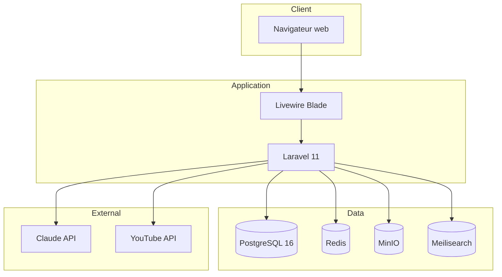

---

## 6. Architecture logicielle

### Principe : Clean Architecture

La logique métier est **exclusivement** dans `app/Services/`. Les controllers et composants Livewire orchestrent et délèguent. L'accès aux données passe par des **repositories** (interfaces + implémentations Eloquent).

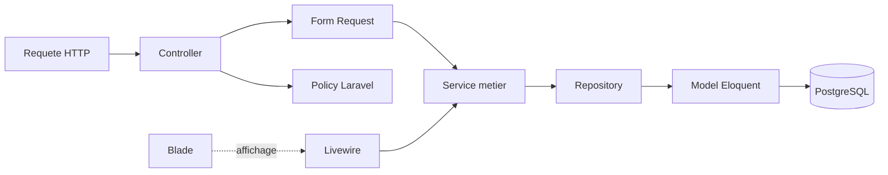

### Couches applicatives

| Couche | Emplacement | Responsabilité |
|---|---|---|
| Présentation | `resources/views/`, `app/Livewire/` | UI, interactions, pas de métier |
| HTTP | `app/Http/Controllers/` | Routing, autorisation, délégation |
| Validation | `app/Http/Requests/` | Règles d'entrée |
| Métier | `app/Services/` | Règles, orchestration, transactions |
| Données | `app/Repositories/` | Requêtes, agrégations |
| Domaine | `app/Models/`, `app/Enums/` | Entités, états |
| Sécurité | `app/Policies/`, `app/Http/Middleware/` | Autorisations |

### Arborescence backend (simplifiée)

```
app/
├── Enums/           DocumentType, DocumentStatus, UserRole, StudyLevel, IdeaSource, AiKind
├── Http/
│   ├── Controllers/ Auth, Document, Event, Profile, Admin, …
│   ├── Middleware/  EnsureHestimEmail, EnsureUserIsAdmin
│   └── Requests/    Validation par module
├── Livewire/        Dashboard, Layout, Auth, Ui
├── Models/          13 modèles (UUID)
├── Policies/        Document, Event, User, …
├── Repositories/    Contracts + Eloquent
└── Services/        16 services métier
```

### Services métier

| Service | Responsabilité |
|---|---|
| `AuthService` | Inscription, validation domaine @hestim.ma |
| `ProfileService` | Profil, avatar |
| `FiliereService` / `ModuleService` | Données académiques |
| `DocumentService` | Upload MinIO, listing, URLs temporaires |
| `RatingService` | Notes 1-5, agrégats |
| `DownloadService` | Journal téléchargements |
| `ModerationService` | Approve / reject |
| `CompanyService` | Entreprises de stage |
| `InternshipReviewService` | Avis stages |
| `ProjectIdeaService` | Projets CV |
| `EventService` | Événements |
| `NotificationService` | Notifications |
| `DashboardService` | KPIs, recommandations dashboard |
| `ClaudeService` | Appels API Claude + persistance `ai_recommendations` |
| `YouTubeService` | Fetch/cache recommandations YouTube par module |

### Injection de dépendances

Les interfaces repository sont liées aux implémentations Eloquent dans `app/Providers/RepositoryServiceProvider.php`.

---

## 7. Modèle de données (ERD)

### Diagramme entité-relation complet

> **GitHub** : le bloc relations-only ci-dessous est compatible github.com. Le détail des colonnes est dans la [section 8](#8-dictionnaire-des-entités). Export visuel : [mermaid.live](https://mermaid.live).

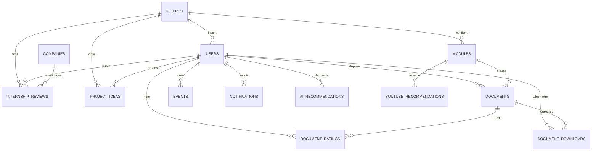

### Diagramme simplifié (vue métier)

> **Note GitHub** : ce schéma est en **texte ASCII** (pas Mermaid) pour garantir l'affichage sur github.com. Le rendu Mermaid de cette vue provoque l'erreur `Cannot read properties of undefined (reading 'render')` avec les sous-graphes et nœuds croisés.

```
                    ┌─────────────┐
                    │  FILIERES   │
                    └──────┬──────┘
                           │
           ┌───────────────┼───────────────┐
           ▼               ▼               │
    ┌─────────────┐ ┌─────────────┐        │
    │   MODULES   │ │    USERS    │        │
    └──────┬──────┘ └──────┬──────┘        │
           │               │               │
           ▼               ├─────────────────┘
    ┌─────────────┐        │
    │  DOCUMENTS  │◄───────┘
    └──────┬──────┘
           │
     ┌─────┴─────┐
     ▼           ▼
┌─────────┐ ┌───────────┐
│ RATINGS │ │ DOWNLOADS │
└─────────┘ └───────────┘

USERS crée aussi ──► PROJECT_IDEAS, EVENTS, NOTIFICATIONS, AI_RECOMMENDATIONS
USERS publie ─────► INTERNSHIP_REVIEWS ◄── COMPANIES
MODULES associe ───► YOUTUBE_RECOMMENDATIONS
```

**Lecture du schéma** :

| Zone | Entités | Relation métier |
|---|---|---|
| Académique | FILIERES → MODULES → DOCUMENTS | Une filière contient des modules ; chaque document est rattaché à un module |
| Utilisateurs | USERS | Compte étudiant ou admin, lié à une filière |
| Contenu | DOCUMENTS, PROJECT_IDEAS, EVENTS | Dépôts, idées CV et événements créés par les users |
| Social | INTERNSHIP_REVIEWS, COMPANIES | Avis de stage liés à une entreprise |
| Engagement | DOCUMENT_RATINGS, DOCUMENT_DOWNLOADS | Notes et téléchargements sur les documents |
| Recommandations | YOUTUBE_RECOMMENDATIONS, AI_RECOMMENDATIONS | Vidéos par module, historique IA par user |
| Système | NOTIFICATIONS | Alertes in-app |

### Clés et conventions

- **Clés primaires** : UUID (`HasUuids` Laravel)
- **Soft deletes** : `users`, `documents`, `internship_reviews`, `project_ideas`, `events`
- **Compteurs dénormalisés** sur `documents` : `downloads_count`, `ratings_count`, `avg_rating`
- **Filières seedées** : GI, GC, GIND, MGT

---

## 8. Dictionnaire des entités

| Table | Description métier | Relations principales |
|---|---|---|
| `filieres` | Filières HESTIM | → modules, users |
| `users` | Comptes étudiants et admins | → filiere, documents, avis, … |
| `modules` | Unités d'enseignement (semestre) | → filiere, documents |
| `documents` | Ressources pédagogiques fichiers | → module, auteur, ratings |
| `document_ratings` | Notes utilisateur (1-5) | → user, document |
| `document_downloads` | Traçabilité téléchargements | → user, document |
| `companies` | Entreprises de stage | → internship_reviews |
| `internship_reviews` | Retours d'expérience stage | → user, company, filiere |
| `project_ideas` | Idées projets portfolio | → user, filiere |
| `events` | Événements école | → user (créateur) |
| `notifications` | Alertes in-app (JSON) | → user |
| `youtube_recommendations` | Cache vidéos par module | → module |
| `ai_recommendations` | Historique prompts Claude | → user, module |

### Énumérations métier

| Enum PHP | Valeurs | Usage |
|---|---|---|
| `DocumentType` | cours, examen, td, tp | Classification ressource |
| `DocumentStatus` | pending, approved, rejected | Workflow modération |
| `UserRole` | student, admin | Autorisations |
| `StudyLevel` | l1, l2, l3, m1, m2 | Projets CV |
| `IdeaSource` | student, ai | Origine idée projet |
| `AiKind` | project, document, study_path, other | Type suggestion IA |

---

## 9. Flux et cas d'utilisation

### Diagramme de cas d'utilisation (UML simplifié)

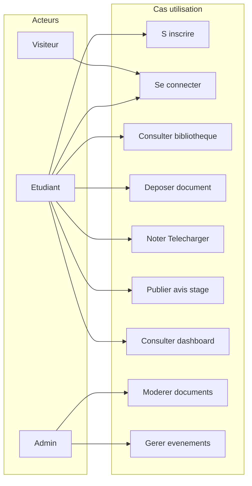

### Flux : dépôt et modération d'un document

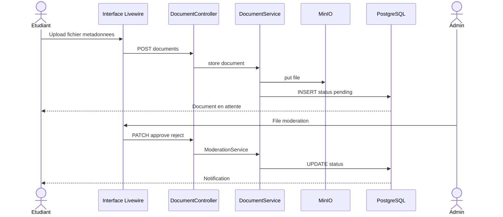

### Flux : authentification HESTIM

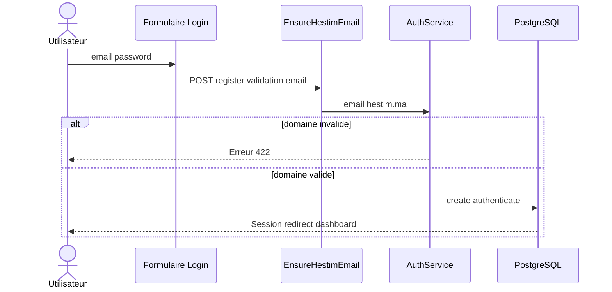

### Routes API / Web principales

| Méthode | URI | Nom | Accès |
|---|---|---|---|
| GET | `/` | `home` | Public |
| GET | `/login` | `login` | Guest |
| POST | `/login` | `login.store` | Guest |
| POST | `/register` | `register` | Guest |
| POST | `/logout` | `logout` | Auth |
| GET | `/dashboard` | `dashboard` | Auth |
| GET/POST | `/documents` | `documents.*` | Auth |
| GET | `/documents/{id}` | `documents.show` | Auth |
| POST | `/documents/{id}/download` | `documents.download` | Auth |
| POST | `/documents/{id}/ratings` | `documents.ratings.store` | Auth |
| GET/POST | `/internship-reviews` | `internship-reviews.*` | Auth |
| GET/POST | `/project-ideas` | `project-ideas.*` | Auth |
| GET | `/events` | `events.index` | Auth |
| GET | `/notifications` | `notifications.index` | Auth |
| GET/PATCH | `/profile` | `profile.*` | Auth |
| GET | `/admin/moderation/documents` | `admin.moderation.*` | Admin |
| GET/POST/PUT/DELETE | `/admin/events` | `admin.events.*` | Admin |

---

## 10. Parcours utilisateur et maquettes

### Correspondance maquette → écran → route

| # | Maquette (`docs/prototype/`) | Vue Blade cible | Route | Priorité |
|---|---|---|---|---|
| 1 | StudyLib Landing.html | `pages/landing.blade.php` | `home` | P0 |
| 2 | StudyLib Login.html | `pages/auth/login.blade.php` | `login` | P0 |
| 3 | StudyLib Dashboard.html | `pages/dashboard/index.blade.php` | `dashboard` | P0 |
| 4 | StudyLib Bibliothèque.html | `pages/documents/index.blade.php` | `documents.index` | P0 |
| 5 | StudyLib Détail Document.html | `pages/documents/show.blade.php` | `documents.show` | P0 |
| 6 | StudyLib Admin.html | `pages/admin/index.blade.php` | `admin.moderation.index` | P0 |
| 7 | StudyLib Stages.html | `pages/internship-reviews/index.blade.php` | `internship-reviews.index` | P1 |
| 8 | StudyLib Projets CV.html | `pages/project-ideas/index.blade.php` | `project-ideas.index` | P1 |
| 9 | StudyLib Événements.html | `pages/events/index.blade.php` | `events.index` | P1 |
| 10 | StudyLib Profil.html | `pages/profile/show.blade.php` | `profile.show` | P1 |
| 11 | — (extension) | `livewire/notifications/index.blade.php` | `notifications.index` | P1 |

### Parcours étudiant type

> *Diagramme simplifié compatible GitHub (le type `journey` Mermaid n'est pas fiable sur github.com).*

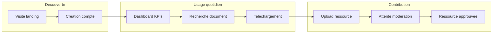

| Etape | Acteur | Satisfaction (1-5) |
|---|---|---|
| Visite landing | Visiteur | 5 |
| Creation compte | Etudiant | 4 |
| Dashboard KPIs | Etudiant | 5 |
| Recherche document | Etudiant | 5 |
| Telechargement | Etudiant | 5 |
| Upload ressource | Etudiant | 4 |
| Attente moderation | Etudiant | 3 |
| Ressource approuvee | Etudiant | 5 |

### Navigation application (sidebar / mobile)

Configurée dans `config/studylib.php` :

- **Principal** : Accueil (dashboard), Bibliothèque, Stages, Projets, Événements
- **Personnel** : Mes dépôts, Favoris (futur), Profil
- **Mobile** : Accueil, Biblio, Stages, Projets, Profil + FAB dépôt

---

## 11. Indicateurs de performance (KPI)

> **Objectif de cette section** : documenter chaque indicateur affiché dans l'interface, sa source technique et surtout **son utilité métier** — matière réutilisable directement dans le chapitre « tableau de bord », « modération » ou « pilotage » d'un rapport.

### 11.1 Pourquoi des KPI dans StudyLib ?

StudyLib traite des contenus **collaboratifs** (documents, avis, événements) dont la valeur dépend de l'**activité collective** et de la **qualité** (modération). Les KPI répondent à trois besoins :

| Besoin | Public | Exemple |
|---|---|---|
| **Orientation** | Étudiant | « Y a-t-il de nouvelles ressources pour ma filière cette semaine ? » |
| **Anticipation** | Étudiant | « Quand est le prochain événement campus ? » |
| **Pilotage** | Administrateur | « Combien d'uploads attendent une validation ? » |

Les KPI ne remplacent pas une analytics avancée (Google Analytics, BI) : ils sont **contextuels**, calculés à la volée depuis PostgreSQL via les **services métier** (`DashboardService`, `ModerationService`, `EventService`, `NotificationService`).

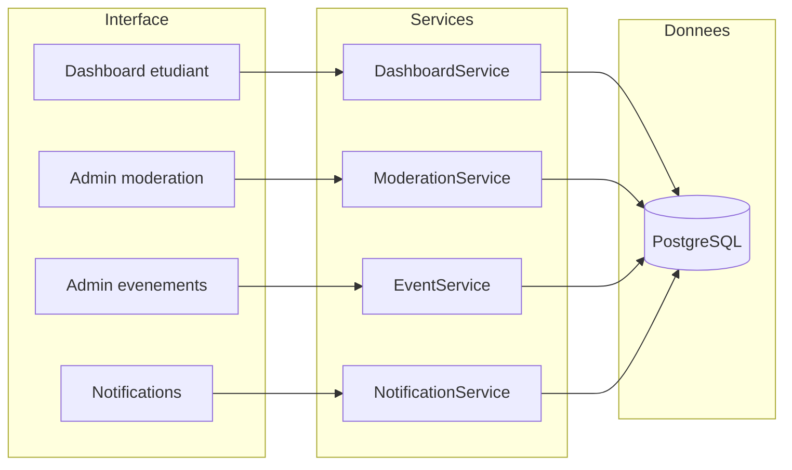

**Fichiers clés** :

| Zone | Service | Vue Livewire |
|---|---|---|
| Dashboard | `app/Services/DashboardService.php` | `resources/views/livewire/dashboard/index.blade.php` |
| Modération | `app/Services/ModerationService.php` | `resources/views/livewire/admin/moderation-index.blade.php` |
| Événements admin | `app/Services/EventService.php` (`adminStats()`) | `resources/views/livewire/admin/events-index.blade.php` |
| Notifications | `app/Services/NotificationService.php` | `resources/views/livewire/notifications/index.blade.php` |

---

### 11.2 Dashboard étudiant (`/dashboard`)

Écran d'accueil après connexion. Quatre cartes KPI en haut, puis contenu recommandé et rail latéral.

#### KPI 1 — Nouveaux documents cette semaine

| Attribut | Détail |
|---|---|
| **Libellé UI** | « Nouveaux documents cette semaine » |
| **Valeur** | Nombre de documents **approuvés et visibles** créés depuis le début de la semaine courante |
| **Calcul** | `DocumentRepository::countApprovedSince($weekStart, $filiereId)` — filtré par **filière de l'étudiant** si renseignée |
| **Indicateur secondaire** | Tendance `+N` si la semaine courante dépasse la semaine précédente (même périmètre filière) |
| **Source** | `DashboardService::overview()` |

**Pourquoi ce KPI ?**

- **Problème adressé** : les étudiants ne savent pas si la bibliothèque « vit » encore sans parcourir toute la liste.
- **Valeur** : mesure l'**effort contributif récent** de la promo (partage de cours, TD, examens). Une tendance positive encourage la consultation et la contribution.
- **Lien objectif projet** : centraliser les ressources pédagogiques et rendre visible la dynamique collaborative HESTIM.
- **Personnalisation** : le filtre par filière évite de compter des documents hors parcours de l'étudiant.

---

#### KPI 2 — Examens disponibles

| Attribut | Détail |
|---|---|
| **Libellé UI** | « Examens disponibles » |
| **Valeur** | Total des documents de type `examen`, statut `approved`, visibles pour la filière |
| **Calcul** | `DocumentRepository::countVisibleByType(DocumentType::Examen, $filiereId)` |
| **Badge optionnel** | « X cette sem. » = examens ajoutés depuis le début de semaine (`countVisibleByTypeSince`) |
| **Source** | `DashboardService::overview()` |

**Pourquoi ce KPI ?**

- **Problème adressé** : en période d'examens, les étudiants cherchent surtout les **annales** et sujets types — ressource la plus demandée sur une plateforme pédagogique.
- **Valeur** : signal immédiat de la **richesse en contenus d'évaluation** disponibles pour réviser, sans ouvrir la bibliothèque.
- **Badge hebdomadaire** : indique si de **nouvelles annales** viennent d'arriver (souvent partagées juste avant les partiels).
- **Lien objectif projet** : faciliter la préparation aux examens via un accès structuré par filière et module.

---

#### KPI 3 — Stages recommandés

| Attribut | Détail |
|---|---|
| **Libellé UI** | « Stages recommandés » |
| **Valeur affichée** | Nombre d'**avis de stage** publiés pour la filière de l'étudiant (`InternshipReviewRepository::countForFiliere`) |
| **Indicateur secondaire** | Libellé « Match 92 % » affiché si le compteur > 0 *(valeur illustrative MVP, pas un score calculé)* |
| **Source** | `DashboardService::overview()` |

**Pourquoi ce KPI ?**

- **Problème adressé** : le choix de stage et d'entreprise repose souvent sur le **bouche-à-oreille** non structuré.
- **Valeur** : traduit la **mémoire collective** des retours d'expérience stage au sein de la filière — proxy du volume d'informations utiles pour orienter une candidature.
- **Lien objectif projet** : objectif secondaire « partager les avis de stages et entreprises ».
- **Évolution prévue** : remplacer le « Match 92 % » par un **score de pertinence réel** (matching filière, niveau, secteur) lorsque le module stages sera enrichi.

> **Note rapport** : distinguer clairement la **valeur métier visée** (recommandations personnalisées) de l'**implémentation actuelle** (comptage des avis existants).

---

#### KPI 4 — Événements à venir

| Attribut | Détail |
|---|---|
| **Libellé UI** | « Événements à venir » |
| **Valeur** | Nombre d'événements dont `starts_at` ≥ maintenant (`EventRepository::countUpcoming`) |
| **Badge optionnel** | « X j. » = jours restants avant le **prochain** événement (`daysUntilNext()`) |
| **Source** | `DashboardService::overview()` |

**Pourquoi ce KPI ?**

- **Problème adressé** : hackathons, conférences et forums campus sont annoncés sur des canaux dispersés (affiches, groupes, emails).
- **Valeur** : donne une **vision temporelle** de la vie étudiante et incite à consulter l'agenda avant de rater une date clé.
- **Badge « X j. »** : urgence douce — rappel du prochain rendez-vous sans ouvrir le calendrier complet.
- **Lien objectif projet** : objectif « afficher événements » et ancrer StudyLib comme **hub de la vie campus**.

---

#### Métriques complémentaires du dashboard (hors cartes KPI)

| Métrique | Où | Calcul / source | Pourquoi |
|---|---|---|---|
| **Complétion du profil** | Panneau « Suggestion IA » (rail droit) | % basé sur 5 champs : nom, email, filière, niveau, avatar (`profileCompletion()`) | Un profil complet améliore les **recommandations** (documents, stages, projets CV) et la **confiance** entre pairs |
| **Notifications non lues** | Cloche topbar + page `/notifications` | `NotificationRepository::unreadCountForUser()` | Informer l'étudiant des **décisions de modération** (document approuvé/refusé) sans qu'il doive revérifier manuellement |
| **Documents recommandés** | Section centrale | `recommendedForFiliere()` — tri **récence** (`ORDER BY created_at DESC`), filtrable par type | Réduit la **charge cognitive** : l'étudiant voit d'abord ce qui concerne **sa filière** |
| **Événements proches** | Rail latéral (3 max) | `EventRepository::upcomingList(3)` | Complète le KPI agrégé par une **liste actionnable** avec lien vers `/events` |
| **Vidéos recommandées** | Rail latéral | `YoutubeRecommendationRepository::forModule()` sur le 1er module de la filière | Objectif post-MVP : enrichir l'apprentissage avec des **ressources vidéo** alignées sur le programme |
| **Suggestion « Projet CV »** | Panneau IA | Combine complétion profil + compteur stages | Pousse l'étudiant vers le module **Projets CV** au moment où il prépare sa candidature stage |

---

### 11.3 Administration — modération documents (`/admin/moderation/documents`)

Quatre cartes KPI + onglets filtrés par statut. Source : `ModerationService::statusCounts()` → `DocumentRepository::adminStatusCounts()`.

#### KPI A — Uploads en attente

| Attribut | Détail |
|---|---|
| **Valeur** | Documents `status = pending` |
| **Comportement UI** | Carte en **alerte visuelle** si > 0 ; lien « Modérer » filtre la liste |
| **Source** | `ModerationService::statusCounts()['pending']` |

**Pourquoi ?**

- **Problème adressé** : tout contenu uploadé doit être **validé** avant publication — file d'attente invisible = risque de lenteur et de frustration étudiante.
- **Valeur admin** : KPI **prioritaire** — indique la charge de travail immédiate et le **SLA implicite** de modération.
- **Lien sécurité** : garantit que seuls des documents **contrôlés** sont visibles (`approved`).

---

#### KPI B — Documents validés

| Attribut | Détail |
|---|---|
| **Valeur** | Documents `status = approved` |

**Pourquoi ?**

- Mesure le **stock de ressources publiées** — indicateur de maturité de la plateforme et de l'engagement des étudiants contributeurs.
- Permet à l'admin de **valider l'impact** de la modération (croissance du catalogue).

---

#### KPI C — Documents refusés

| Attribut | Détail |
|---|---|
| **Valeur** | Documents `status = rejected` |

**Pourquoi ?**

- Trace les contenus **non conformes** (qualité, doublon, hors sujet, droits).
- Un ratio élevé peut signaler un **besoin de communication** sur les règles de dépôt ou un abus — utile pour le chapitre « qualité du contenu » du rapport.

---

#### KPI D — Documents au total

| Attribut | Détail |
|---|---|
| **Valeur** | Tous statuts confondus (`all`) |

**Pourquoi ?**

- Vue **macro** du volume traité par la modération (pending + approved + rejected).
- Sert de **dénominateur** pour calculer des taux (ex. taux d'approbation = approved / all) dans une analyse quantitative du rapport.

---

### 11.4 Administration — événements (`/admin/events`)

Trois cartes KPI. Source : `EventService::adminStats()`.

#### KPI E — Événements à venir

| Attribut | Détail |
|---|---|
| **Valeur** | `EventRepository::countUpcoming()` — même logique que le dashboard étudiant |

**Pourquoi ?**

- Permet à l'admin de vérifier que l'**agenda public** reste alimenté avant les périodes clés (rentrée, forums emploi, hackathons).
- Aligne le pilotage admin avec ce que voit l'étudiant sur son dashboard.

---

#### KPI F — Ce mois-ci

| Attribut | Détail |
|---|---|
| **Valeur** | Nombre d'événements dont la date de début tombe dans le **mois calendaire courant** (`forMonth(year, month)`) |

**Pourquoi ?**

- Vision **court terme** pour planifier communication interne et salles.
- Complète le KPI « à venir » (futur) par une photo du **mois en cours**.

---

#### KPI G — Total en base

| Attribut | Détail |
|---|---|
| **Valeur** | `EventRepository::countAll()` — tous les événements enregistrés |

**Pourquoi ?**

- Historique et **capital événementiel** de l'établissement dans StudyLib.
- Utile pour mesurer l'adoption du module admin CRUD événements dans le temps.

---

### 11.5 Notifications (`/notifications`)

| Métrique | Détail |
|---|---|
| **Compteur non lues** | `NotificationService::unreadCount()` — notifications sans `read_at` |
| **Types principaux** | Document approuvé, document refusé (via `notifyDocumentReviewed`) |

**Pourquoi ?**

- **Problème adressé** : après un upload, l'étudiant ne sait pas quand sa ressource est publiée ou rejetée.
- **Valeur** : boucle de **feedback** sur le workflow modération — améliore la transparence et la confiance dans la plateforme.
- **Lien UX** : la cloche dans la topbar expose le compteur sans quitter la page courante.

---

### 11.6 Synthèse — tableau récapitulatif pour le rapport

| KPI | Écran | Acteur | Question métier à laquelle il répond |
|---|---|---|---|
| Nouveaux documents / semaine | Dashboard | Étudiant | La promo partage-t-elle encore des ressources ? |
| Examens disponibles | Dashboard | Étudiant | Ai-je accès à des annales pour réviser ? |
| Stages recommandés | Dashboard | Étudiant | Y a-t-il des retours d'expérience stage pour ma filière ? |
| Événements à venir | Dashboard | Étudiant | Que se passe-t-il prochainement sur le campus ? |
| Complétion profil | Dashboard (rail) | Étudiant | Mon profil est-il suffisant pour des recommandations fiables ? |
| Uploads en attente | Admin modération | Admin | Quelle est ma file de modération à traiter ? |
| Documents validés / refusés / total | Admin modération | Admin | Quel est l'état et la qualité du catalogue ? |
| Événements (à venir / mois / total) | Admin événements | Admin | L'agenda campus est-il à jour ? |
| Notifications non lues | Topbar + page | Étudiant | Ai-je des retours sur mes contributions ? |

### 11.7 Paragraphe type mémoire (KPI)

> Les indicateurs de performance intégrés à StudyLib traduisent des **besoins utilisateurs concrets** plutôt qu'une logique de reporting générique. Sur le **dashboard étudiant**, quatre KPI synthétisent l'activité pédagogique (nouveaux documents, examens), la dimension carrière (avis de stages) et la vie campus (événements), le tout **filtré par filière** lorsque c'est pertinent. Côté **administration**, les KPI de modération mettent en avant la file d'attente (`pending`) — gage de qualité du contenu publié — tandis que les KPI événements permettent un pilotage de l'agenda institutionnel. Chaque indicateur est calculé côté serveur via une couche service (`DashboardService`, `ModerationService`, `EventService`), conformément à l'architecture en couches retenue pour le projet.

---

## 12. Systèmes de recommandation et intelligence artificielle

> **Objectif de cette section** : expliquer **quoi** est recommandé, **comment** l'algorithme ou la règle fonctionne, **pourquoi** ce choix a été retenu, et **où** cela se trouve dans le code — avec pour chaque brique la structure : *contexte → arguments → exemple → conclusion*.

### 12.1 Contexte général — le problème de la surcharge informationnelle

#### Contexte et problème

Sur une plateforme pédagogique, le volume de documents, d'avis de stage et de ressources externes croît rapidement. Sans aide, l'étudiant :

- ne sait **pas par où commencer** après connexion ;
- perd du temps à **filtrer manuellement** des centaines de fichiers ;
- manque de **retours structurés** pour choisir un stage ou un projet CV ;
- ignore les **ressources vidéo** pertinentes pour un module donné.

StudyLib répond à ce problème par une **stratégie hybride** : des recommandations **déterministes** (règles métier + SQL) en MVP, complétées par de l'**IA générative** (Claude) et, à terme, par une **recherche full-text** (Meilisearch).

#### Typologie des approches retenues

| Approche | Principe | Où dans StudyLib | Maturité |
|---|---|---|---|
| **Filtrage par profil** (content-based) | Recommander ce qui correspond à la filière, au module, au niveau | Dashboard, détail document, bibliothèque | ✅ MVP |
| **Popularité + qualité** (signaux implicites) | Trier par notes moyennes et téléchargements | Documents similaires, tri « populaire » | ✅ MVP |
| **Règles métier** (rule-based) | Seuils explicites (ex. note ≥ 4,5 et ≥ 2 avis) | Badge « Recommandé » stages | ✅ MVP |
| **Génération IA** (LLM) | Prompt structuré → réponse JSON → persistance | Projets CV (`ProjectIdeaService`) | ✅ MVP |
| **API externe + cache** | Requête YouTube, résultats stockés en base | Vidéos dashboard / module | ⏳ Partiel |
| **Recherche full-text** (Meilisearch) | Index inversé, typo-tolerance, ranking BM25 | Bibliothèque (post-MVP) | ❌ Planifié |
| **Filtrage collaboratif** (CF) | « Les étudiants similaires ont aussi consulté… » | — | ❌ Perspectives |

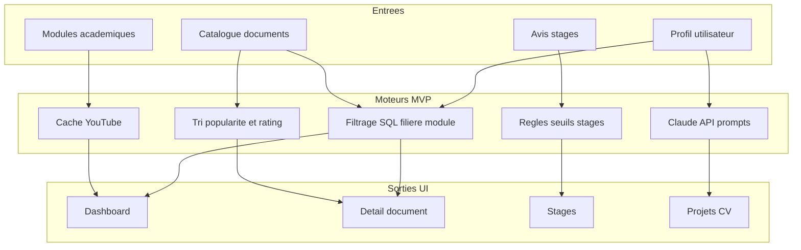

#### Conclusion (vue d'ensemble)

StudyLib ne repose **pas** sur un unique « algorithme de recommandation » type Netflix. C'est un **assemblage de moteurs spécialisés**, chacun adapté au type de contenu et au niveau de données disponible en MVP. Cette approche **incrémentale** est justifiable dans un rapport : elle livre de la valeur immédiate tout en préparant des évolutions (Meilisearch, CF, scoring stages).

---

### 12.2 Recommandation documentaire — dashboard (`/dashboard`)

#### Contexte et problème

À l'ouverture de l'application, l'étudiant doit voir **immédiatement** des ressources pertinentes pour **sa filière**, sans configurer de filtres.

#### Quoi ?

Section **« Recommandés pour vous »** : liste de 5 documents maximum, filtrable par type (tous, cours, examen, TD, TP).

#### Comment ? (algorithme)

**Type** : recommandation **content-based** par filière + tri **chronologique**.

**Pseudo-code** :

```
ENTRÉE : user.filiere_id, type_optionnel, limit = 5
SI user.filiere_id est NULL → retourner liste vide

REQUÊTE SQL :
  documents WHERE status = approved (scope visible)
    AND module.filiere_id = user.filiere_id
    AND (type = type_optionnel SI fourni)
  ORDER BY created_at DESC
  LIMIT 5
```

**Propriétés algorithmiques** :

| Propriété | Valeur |
|---|---|
| Personnalisation | Oui — filière utilisateur |
| Cold start (nouvel utilisateur sans filière) | Liste vide — incite à compléter le profil |
| Cold start (nouveau document) | Apparaît en tête si récent et approuvé |
| Complexité | O(1) avec index sur `module_id`, `created_at` |

#### Où ?

| Couche | Fichier |
|---|---|
| Orchestration | `DashboardService::recommendedDocuments()` |
| Requête | `DocumentRepository::recommendedForFiliere()` |
| UI | `Livewire\Dashboard\Index` → `livewire/dashboard/index.blade.php` |

#### Pourquoi ce choix ?

- **Simple et explicable** dans un rapport académique (pas de boîte noire).
- **Cohérent métier HESTIM** : la filière est le principal axe pédagogique.
- **Performant** : une requête SQL indexée, pas d'appel API externe.
- **Limite assumée** : ne tient pas compte des goûts individuels ni de l'historique de téléchargement — évolution CF prévue en post-MVP.

#### Exemple concret

> *Amina*, étudiante en Génie Informatique (GI), ouvre son dashboard un mardi. Le système charge les 5 derniers documents **approuvés** rattachés à un module GI. Elle clique sur le filtre « Examen » : la requête ajoute `WHERE type = 'examen'`. Elle voit trois annales de « Algorithmique » publiées la semaine précédente.

#### Conclusion

C'est la recommandation **prioritaire MVP** : filière + récence. Elle répond au besoin « quoi de neuf pour ma promo ? » sans sur-ingénierie.

---

### 12.3 Recommandation documentaire — détail (`/documents/{id}`)

#### Contexte et problème

Un étudiant consulte un cours ou un TD : il a besoin de **documents connexes** (même module) et d'**annales** pour préparer l'examen, sans retourner à la bibliothèque.

#### Quoi ?

Trois blocs de recommandation sur le rail droit :

1. **« Recommandé pour votre niveau »** — bandeau contextuel (pas une liste)
2. **« Documents similaires »** — jusqu'à 3 documents du même module
3. **« Examens — même module »** — jusqu'à 2 annales triées par popularité

#### Comment ? (algorithmes)

**A) Bandeau « Recommandé pour votre niveau »**

**Type** : règle booléenne (rule-based), **pas** un score.

```
SI viewer.filiere_id === document.module.filiere_id
  ALORS afficher bandeau avec filière + niveau L{n} + semestre
SINON masquer
```

**B) Documents similaires**

**Type** : content-based (même module) + **ranking hybride popularité/qualité**.

```
ENTRÉE : document courant, limit = 3

REQUÊTE :
  documents WHERE module_id = document.module_id
    AND id ≠ document.id
    AND visible (approved)
  ORDER BY avg_rating DESC, downloads_count DESC
  LIMIT 3
```

**C) Examens du même module**

```
ENTRÉE : document courant, limit = 2

REQUÊTE :
  documents WHERE module_id = document.module_id
    AND type = 'examen'
    AND id ≠ document.id
    AND visible
  ORDER BY downloads_count DESC
  LIMIT 2
```

#### Où ?

| Bloc | Service | Repository |
|---|---|---|
| Page complète | `DocumentService::showPageData()` | — |
| Similaires | — | `DocumentRepository::similarInModule()` |
| Examens | — | `DocumentRepository::examsInModule()` |
| Bandeau filière | Vue Blade (condition `@if`) | `livewire/documents/show.blade.php` |

#### Pourquoi ces choix ?

- **Même module** = proxy fort de pertinence académique (syllabus HESTIM).
- **avg_rating puis downloads_count** : favorise la **qualité perçue** par les pairs, puis la **utilité réelle** (téléchargements).
- **Examens séparés** : répond à un cas d'usage distinct (révision vs complément de cours).

#### Exemple concret

> *Karim* consulte le PDF « Structures de données — Chapitre 3 » (module S3 GI). Le rail affiche :
> - Bandeau « Pertinent pour Génie Informatique L3 — Semestre 5 » ;
> - 3 TD du même module, dont celui avec 4,8/5 et 120 téléchargements en premier ;
> - 2 annales d'examen les plus téléchargées.

#### Conclusion

La page détail combine **contexte profil** (bandeau) et **similarité contenu** (module + signaux collectifs). C'est un cas classique de **content-based filtering enrichi par des métadonnées communautaires** (notes, downloads).

---

### 12.4 Bibliothèque — recherche et tri (`/documents`)

#### Contexte et problème

Le dashboard ne suffit pas pour explorer tout le catalogue. L'étudiant doit **chercher**, **filtrer** et **trier** selon ses critères.

#### Quoi ?

Listing paginé avec filtres : texte libre, filière, semestre, module, année, types, note minimale, « mes dépôts » ; tri **récent** ou **populaire**.

#### Comment ? (algorithme)

**Type** : **recherche par correspondance partielle** (SQL `LIKE`) + filtrage multi-critères + tri.

**Recherche textuelle (MVP)** :

```
SI q non vide :
  WHERE title LIKE '%q%'
     OR module.name LIKE '%q%'
     OR author.name LIKE '%q%'
```

**Tri populaire** :

```
ORDER BY downloads_count DESC, created_at DESC
```

**Tri récent (défaut)** :

```
ORDER BY created_at DESC
```

**Filtre note minimale** :

```
WHERE avg_rating >= min_rating
```

*(Les compteurs `avg_rating`, `downloads_count`, `ratings_count` sont **dénormalisés** sur `documents` et recalculés à chaque notation via `RatingService` + `DocumentRepository::syncRatingAggregates()`.)*

#### Où ?

| Couche | Fichier |
|---|---|
| Service | `DocumentService::browse()` |
| Requête | `DocumentRepository::browse()` / `browseQuery()` |
| UI | `Livewire\Documents\Index` |

#### Pourquoi ce choix ?

- **LIKE SQL** : suffisant pour un MVP de taille modérée (promo HESTIM), zéro dépendance externe.
- **Limite** : pas de tolérance aux fautes, pas de ranking sémantique → **Meilisearch** prévu (section 12.8).
- **Tri popularité** : signal implicite simple (« ce que la promo utilise le plus »).

#### Exemple concret

> Recherche `q = "algo"`, filière GI, `min_rating = 4`, tri `popular` → retourne les documents dont le titre ou le module contient « algo », note moyenne ≥ 4, ordonnés par téléchargements décroissants.

#### Conclusion

La bibliothèque est le **moteur de découverte manuelle** ; les recommandations dashboard/détail en sont le **complément proactif**. Les deux partagent la même source de données et les mêmes agrégats de qualité.

---

### 12.5 Recommandation stages — entreprises (`/internship-reviews`)

#### Contexte et problème

Choisir une entreprise de stage est risqué sans retour d'expérience fiable. StudyLib agrège des **avis notés** par filière, ville, secteur et année.

#### Quoi ?

- Listing d'entreprises avec tri par **note moyenne**, **nombre d'avis** ou **avis récent**
- Badge **« Recommandé »** sur certaines fiches entreprise

#### Comment ? (algorithmes)

**A) Classement du listing**

**Type** : agrégation SQL + tri paramétrable.

```
Pour chaque entreprise :
  avg_rating = AVG(internship_reviews.rating)
  reviews_count = COUNT(reviews)
  latest_review_at = MAX(reviews.created_at)

Tri par défaut (rating) : ORDER BY avg_rating DESC
Tri reviews : ORDER BY reviews_count DESC
Tri recent : ORDER BY latest_review_at DESC

Filtres optionnels : ville, secteur, filiere_id, year_level, min_rating
```

**B) Badge « Recommandé »**

**Type** : règle métier à **double seuil** (rule-based).

```
recommended = (avg_rating >= 4.5) ET (reviews_count >= 2)
```

**Justification des seuils** :

| Seuil | Raison |
|---|---|
| ≥ 4,5 / 5 | Expérience globalement très positive |
| ≥ 2 avis | Réduit le biais d'un avis isolé (robustesse statistique minimale) |

#### Où ?

| Élément | Fichier |
|---|---|
| Listing | `CompanyRepository::browse()` |
| Badge UI | `components/internships/company-card.blade.php` |
| Service | `InternshipReviewService::browse()` |

#### Pourquoi ce choix ?

- **Transparent** : règle explicite, défendable devant un jury.
- **Pas de ML nécessaire** au MVP : peu de données au lancement.
- **Évolution** : pondération par filière/niveau de l'étudiant connecté, score de matching (remplacer le placeholder « Match 92 % » du dashboard).

#### Exemple concret

> L'entreprise « TechMaroc » a 3 avis GI (notes 5, 4, 5) → moyenne 4,7 et badge « Recommandé ». « StartupX » a 1 avis à 5/5 → pas de badge (un seul retour).

#### Conclusion

La recommandation stage MVP est **collective et prudente** : on ne recommande que ce qui est **suffisamment noté** et **suffisamment positif**. C'est une forme de **filtrage par réputation agrégée**.

---

### 12.6 Recommandation vidéo YouTube

#### Contexte et problème

Certains modules s'appuient sur des explications visuelles (tutoriels, conférences). YouTube contient des ressources pertinentes mais **bruitées** et **hors plateforme**.

#### Quoi ?

- Rail **« Vidéos recommandées »** sur le dashboard (2 vidéos)
- Endpoint JSON `GET /modules/{module}/youtube`

#### Comment ? (architecture)

**Type** : **cache local** + API YouTube Data v3 (fetch à la demande ou via seed).

**Flux actuel (MVP)** :

```
1. DashboardService::featuredVideos(user)
2. Récupérer le 1er module de la filière (orderBy semester)
3. YoutubeRecommendationRepository::forModule(module_id, limit=2)
4. Retourner les entrées triées par position ASC
```

**Fetch API (service disponible, quota-aware)** :

```
YouTubeService::fetchFromApi(query)
  → Cache Redis/file 24h clé "youtube:search:{query}"
  → GET youtube/v3/search?q={query}&type=video&maxResults=6
  → (persistance en youtube_recommendations : pipeline admin/seed post-MVP)
```

**Table `youtube_recommendations`** : `module_id`, `video_id`, `title`, `channel`, `thumbnail_url`, `position`, `fetched_at`.

#### Où ?

| Couche | Fichier |
|---|---|
| Dashboard | `DashboardService::featuredVideos()` |
| API | `YouTubeService`, `YoutubeRecommendationController` |
| Config | `config/services.php` → `YOUTUBE_API_KEY` |

#### Pourquoi ce choix ?

- **Cache 24 h** : respect du **quota API** Google (unités limitées/jour).
- **Liaison module** : ancrage pédagogique (pas de recommandations génériques).
- **Limite MVP** : pas de personnalisation par niveau ; le premier module du semestre sert de proxy.

#### Exemple concret

> Étudiant GI → module « Programmation Web S1 » → 2 vidéos seedées « HTML/CSS crash course » et « JavaScript fondamentaux » s'affichent sur le dashboard.

#### Conclusion

YouTube est traité comme une **source externe curatée** : StudyLib ne « devine » pas les vidéos en temps réel à chaque page, mais **sert un cache par module** pour performance et coût maîtrisés.

---

### 12.7 Intelligence artificielle — Claude (Anthropic)

#### Contexte et problème

Les idées de **projets CV** manquent souvent d'originalité ou de adéquation au niveau (L3 vs M2). Un étudiant peut savoir coder sans savoir **quoi mettre en portfolio** pour décrocher un stage.

#### Quoi ?

- **Génération d'idées de projets CV** via formulaire Livewire (filière, niveau, centres d'intérêt)
- **API générique** `POST /ai/suggestions` pour d'autres types (`AiKind`)
- **Traçabilité** de chaque appel dans `ai_recommendations`

#### Comment ? (architecture et flux)

**Modèle** : LLM **Claude** (par défaut `claude-3-5-sonnet-latest`, configurable via `CLAUDE_MODEL`).

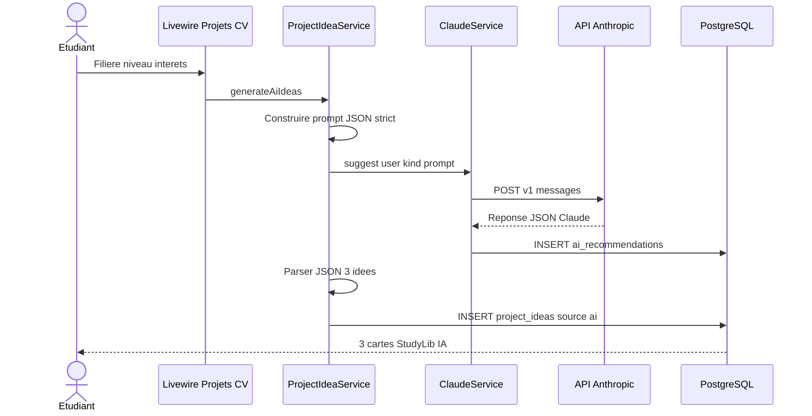

**Étapes détaillées** :

1. **Construction du prompt** (`ProjectIdeaService::generateAiIdeas`) :
   - Rôle système implicite : « conseiller pédagogique HESTIM »
   - Paramètres injectés : filière, niveau (`StudyLevel`), centres d'intérêt
   - Contrainte de format : **JSON strict** `[{"title":"...","description":"..."}]` sans markdown

2. **Appel HTTP** (`ClaudeService::suggest`) :
   - Headers : `x-api-key`, `anthropic-version: 2023-06-01`
   - Body : `model`, `max_tokens: 1024`, `messages: [{role: user, content: prompt}]`

3. **Persistance audit** :
   - Table `ai_recommendations` : `user_id`, `kind`, `module_id`, `prompt`, `response` (JSON brut), `model`, `tokens_used`

4. **Parsing et validation** :
   - Extraction du texte depuis `response.content[].text`
   - Nettoyage éventuel des blocs markdown ` ```json `
   - `json_decode` + validation de chaque `{title, description}`

5. **Fallback dégradé** :
   - Si API indisponible ou JSON invalide → **3 idées génériques** prédéfinies (`fallbackAiPayload`)
   - Garantit une UX fonctionnelle même sans clé API

6. **Rate limiting** :
   - `throttle:ai` → **20 requêtes / heure / utilisateur** (`AppServiceProvider`)

**Types IA prévus (`AiKind`)** :

| Kind | Usage | Statut UI |
|---|---|---|
| `project` | Idées projets CV | ✅ Formulaire Livewire |
| `document` | Suggestion ressource | ⏳ API seule |
| `study_path` | Parcours d'étude | ⏳ API seule |
| `other` | Extensible | ⏳ API seule |

#### Où ?

| Couche | Fichier |
|---|---|
| Appel API | `ClaudeService.php` |
| Cas métier projets | `ProjectIdeaService.php` |
| Endpoint HTTP | `AiRecommendationController`, route `POST /ai/suggestions` |
| Validation | `StoreAiSuggestionRequest` |
| Config | `config/services.php` → `CLAUDE_API_KEY`, `CLAUDE_API_URL`, `CLAUDE_MODEL` |
| UI | `livewire/project-ideas/index.blade.php` |
| Modèle trace | `AiRecommendation`, migration `ai_recommendations` |

#### Pourquoi Claude (et pas un modèle local) ?

| Argument | Détail |
|---|---|
| **Qualité rédactionnelle** | Idées de projets structurées, adaptées au niveau académique |
| **Time-to-market** | API prête, pas d'infra GPU à maintenir pour un PFE |
| **Traçabilité** | Chaque prompt/réponse stocké pour audit et amélioration |
| **Coût maîtrisé** | Rate limit + max_tokens 1024 + fallback sans API |
| **Risques** | Dépendance externe, coût tokens, hallucinations → atténués par JSON strict + fallback + modération humaine implicite (l'étudiant choisit) |

#### Exemple concret

**Entrée** : GI, M1, intérêts « React, API REST »

**Prompt (extrait)** :

> Tu es un conseiller pédagogique HESTIM. Propose exactement 3 idées de projets CV concrètes pour un étudiant en Génie Informatique (Master 1). Centres d'intérêt : React, API REST. Réponds UNIQUEMENT avec un JSON valide…

**Sortie attendue** (après parsing) :

```json
[
  {"title": "Dashboard de suivi énergétique", "description": "Application React consommant une API REST..."},
  {"title": "Marketplace étudiante HESTIM", "description": "..."},
  {"title": "Outil de revision collaborative", "description": "..."}
]
```

→ 3 entrées `project_ideas` avec `source = ai`, auteur affiché « StudyLib IA ».

#### Conclusion

L'IA dans StudyLib est **générative et assistée** : elle **propose**, l'étudiant **valide et publie**. Ce n'est pas un moteur de recommandation passif mais un **copilote pédagogique**, avec garde-fous techniques (rate limit, fallback, historique) adaptés à un contexte académique.

---

### 12.8 Recherche full-text Meilisearch (planifié — P2)

#### Contexte et problème

La recherche SQL `LIKE` devient insuffisante quand :

- le catalogue dépasse quelques centaines de documents ;
- l'étudiant fait des **fautes de frappe** (« algoritme », « examn ») ;
- il cherche dans le **contenu** des descriptions longues.

#### Quoi ? (cible)

Index Meilisearch `documents` avec ranking BM25, filtres facettes (filière, type, module), typo-tolerance.

#### Comment ? (architecture cible)

```
1. À l'approbation d'un document → job queue indexe {title, description, module, type, filiere}
2. Recherche utilisateur → Meilisearch.search(q, {filter: "filiere = GI"})
3. Retour IDs ordonnés par pertinence → hydratation Eloquent
```

**Algorithme BM25** (Meilisearch par défaut) : score de pertinence basé sur la fréquence des termes et la longueur du document — standard industrie pour la recherche textuelle.

#### Où ?

| Élément | Statut |
|---|---|
| Docker `meilisearch:v1.12` | ✅ Infra prête (`docker-compose.yml`) |
| Code Laravel Scout / client Meilisearch | ❌ Non implémenté |
| Variable `MEILISEARCH_HOST` | Documentée |

#### Pourquoi Meilisearch ?

- Open source, léger, **typo-tolerance** native
- Meilleur rapport simplicité/performance qu'un `LIKE` SQL pour du full-text
- Complète (ne remplace pas) les recommandations filière/module

#### Exemple concret (cible)

> Recherche `algoritme` → trouve « Algorithmique avancée » malgré la faute ; filtres facettes `type:examen` + `filiere:GI`.

#### Conclusion

Meilisearch est la **brique de découverte** future ; les recommandations MVP restent en SQL jusqu'à intégration P2.

---

### 12.9 Agrégats de qualité — alimentation des recommandations

#### Contexte et problème

Les tris par `avg_rating` et `downloads_count` supposent des **compteurs fiables** mis à jour en temps réel.

#### Comment ?

**À chaque notation** (`RatingService::rate`) :

```
1. Upsert document_ratings (user, document, score 1-5)
2. Transaction SQL
3. DocumentRepository::syncRatingAggregates(document)
   → avg_rating = AVG(scores)
   → ratings_count = COUNT(scores)
```

**À chaque téléchargement** (`DownloadService`) :

```
→ increments downloads_count sur documents
```

#### Pourquoi dénormaliser ?

- Évite un `AVG()` / `COUNT()` coûteux à chaque listing
- Permet un tri **populaire** et **qualité** en O(1) par ligne document

#### Où ?

`RatingService.php`, `DownloadService.php`, `DocumentRepository::syncRatingAggregates()`

#### Conclusion

Les signaux **explicites** (notes) et **implicites** (téléchargements) constituent la base des recommandations par popularité — approche classique de **crowd-powered ranking**.

---

### 12.10 Feuille de route algorithmique

| Phase | Amélioration | Algorithme | Impact |
|---|---|---|---|
| **MVP (actuel)** | Filière + module + récence | SQL content-based | ✅ Livré |
| **MVP (actuel)** | Popularité + notes | Tri agrégats dénormalisés | ✅ Livré |
| **MVP (actuel)** | Badge stage | Rule-based seuils | ✅ Livré |
| **MVP (actuel)** | Projets CV IA | LLM prompt + JSON | ✅ Livré |
| **P2** | Recherche bibliothèque | Meilisearch BM25 | Haute |
| **P2** | YouTube auto-fetch | API + cache + seed cron | Moyenne |
| **P3** | Matching stages | Score filière × niveau × secteur | Haute |
| **P3** | Filtrage collaboratif | Co-visitation / co-téléchargement | Moyenne |
| **P3** | Embeddings sémantiques | Vecteurs document → similarité cosinus | Recherche long terme |

---

### 12.11 Synthèse — tableau « Quoi / Comment / Pourquoi / Où »

| Fonctionnalité | Quoi ? | Comment ? | Pourquoi ? | Où ? |
|---|---|---|---|---|
| Dashboard docs | Top 5 filière | SQL filière + `ORDER BY created_at DESC` | Accueil personnalisé simple | `DashboardService` |
| Docs similaires | 3 docs même module | `ORDER BY avg_rating, downloads_count` | Continuité pédagogique | `similarInModule()` |
| Examens liés | 2 annales module | `type=examen` + downloads | Préparation examens | `examsInModule()` |
| Bandeau niveau | Message contextuel | `filiere_id` égalité | Rassurer sur pertinence | `show.blade.php` |
| Bibliothèque | Filtres + tri | SQL LIKE + agrégats | Exploration manuelle | `DocumentRepository::browse()` |
| Stages | Badge Recommandé | `avg ≥ 4.5 AND count ≥ 2` | Confiance collective | `company-card.blade.php` |
| YouTube | 2 vidéos dashboard | Cache table `youtube_recommendations` | Enrichissement module | `YouTubeService` |
| Projets CV IA | 3 idées générées | Claude API + JSON parse + fallback | Copilote portfolio | `ProjectIdeaService` |
| Trace IA | Audit prompts | INSERT `ai_recommendations` | Traçabilité / coût | `ClaudeService` |
| Recherche (futur) | Full-text | Meilisearch BM25 | Scale + typos | Docker prêt, code P2 |

### 12.12 Paragraphe type mémoire (recommandation & IA)

> Face à la dispersion des ressources pédagogiques, StudyLib met en œuvre une **stratégie de recommandation hybride**. En phase MVP, les contenus documentaires sont suggérés par **filtrage sur profil académique** (filière, module) et par **signaux collectifs** (notes moyennes, volumes de téléchargement), approche content-based transparente et performante en SQL. Les avis de stage s'appuient sur des **règles de réputation** à double seuil. L'intelligence artificielle intervient via l'API **Claude** pour la **génération d'idées de projets CV** : un prompt structuré produit un JSON validé, persisté à des fins d'audit, avec mécanisme de repli si l'API est indisponible. Cette architecture modulaire prépare l'intégration future de **Meilisearch** (recherche BM25) et de scores de matching stages plus fins, sans remettre en cause les fondations Clean Architecture (services → repositories → PostgreSQL).

---

## 13. Design system et interface

### Sources

| Fichier | Contenu |
|---|---|
| `docs/prototype/tokens.css` | Tokens CSS (couleurs, typo, espacements) |
| `docs/design-system/StudyLib Design System.html` | Catalogue composants |
| `resources/css/app.css` | Implémentation Tailwind + classes `sl-*` |

### Tokens principaux

| Catégorie | Exemples |
|---|---|
| Couleurs primaires | `#1D4ED8` (primary), `#DBEAFE` (primary-soft) |
| Neutres | ink `#0F172A`, muted `#64748B`, surface `#F8FAFC` |
| Sémantiques | success, warning, danger, info |
| Typographie | Inter (sans), JetBrains Mono (mono) |
| Rayons | sm 10px, md 14px, lg 18px |
| Layout | header 64px, sidebar 264px, container 1200px |

### Composants UI implémentés

| Composant | Fichier Blade | Usage |
|---|---|---|
| Bouton | `components/ui/button.blade.php` | Actions primaires/secondaires |
| Badge | `components/ui/badge.blade.php` | Statuts, compteurs |
| Input / Field | `components/ui/input.blade.php` | Formulaires |
| Search | `components/ui/search.blade.php` | Barre recherche |
| Card ressource | `components/ui/card.blade.php` | Bibliothèque |
| Table | `components/ui/table.blade.php` | Admin, listes |
| Uploader | `components/ui/uploader.blade.php` | Dépôt fichiers |
| Pagination | `components/ui/pagination.blade.php` | Listes paginées |
| Toast / Flash | `components/ui/toast.blade.php` | Retours système |
| Modal | `components/ui/modal.blade.php` | Confirmations |
| Empty state | `components/ui/empty-state.blade.php` | Listes vides |
| Star rating | `components/ui/star-rating.blade.php` | Notation documents |

### Layouts

| Layout | Usage |
|---|---|
| `<x-layouts.app>` | Espace authentifié (sidebar, topbar, bottom nav) |
| `<x-layouts.guest>` | Login / register |
| `<x-layouts.admin>` | Administration |
| `<x-layouts.marketing>` | Landing page |

### Principes UX

- Mobile-first, responsive (breakpoints ~860px, ~920px)
- Accessibilité WCAG AA (focus visible, labels, aria)
- Pas d'écrans ou champs inventés hors maquettes
- Pas de tiret cadratin double `——` dans l'UI

---

## 14. Sécurité et conformité

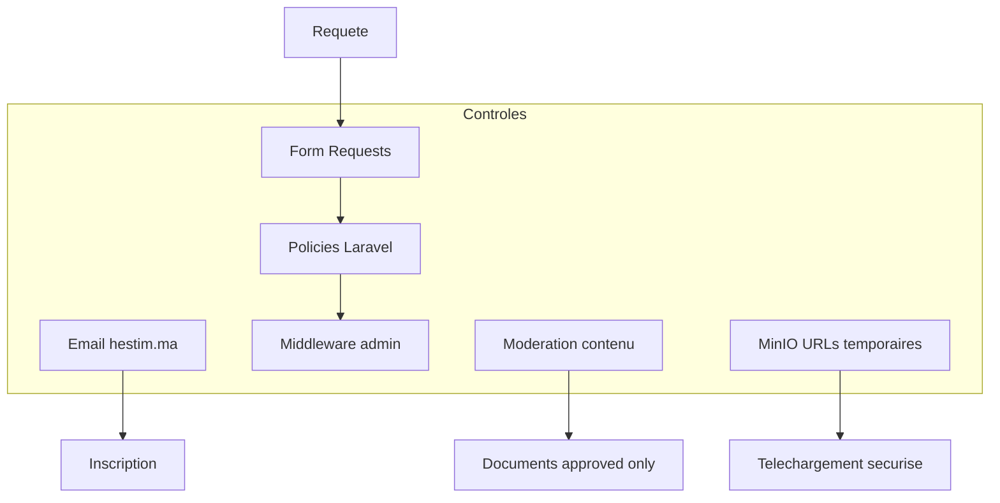

| Mesure | Implémentation |
|---|---|
| Authentification domaine | `HestimEmail`, `EnsureHestimEmail`, `AuthService` |
| Autorisation | Policies sur Document, Event, User, … |
| Validation entrées | Form Requests dédiées |
| Visibilité documents | `approved` OU auteur OU admin |
| Fichiers | Stockage MinIO, pas d'exposition directe des chemins |
| Rôles | `student` / `admin` via `UserRole` |
| CSRF | Tokens Laravel sur formulaires |
| Mots de passe | Hash bcrypt (Laravel default) |

---

## 15. Infrastructure et déploiement

### Docker Compose (`docker-compose.yml`)

| Service | Image | Port par défaut | Rôle |
|---|---|---|---|
| postgres | postgres:16-alpine | 5432 | Base de données |
| redis | redis:7-alpine | 6379 | Cache, sessions, queues |
| minio | minio/minio | 9000 / 8900 | Stockage fichiers |
| meilisearch | getmeili/meilisearch:v1.12 | 7700 | Recherche full-text |

### Variables d'environnement cibles

```env
DB_CONNECTION=pgsql
DB_HOST=postgres
DB_DATABASE=studylib

REDIS_HOST=redis
CACHE_STORE=redis
SESSION_DRIVER=redis
QUEUE_CONNECTION=redis

MINIO_ENDPOINT=http://minio:9000
MINIO_BUCKET=studylib

MEILISEARCH_HOST=http://meilisearch:7700

CLAUDE_API_KEY=
YOUTUBE_API_KEY=
```

### Comptes de test (seed)

| Email | Rôle | Mot de passe |
|---|---|---|
| `admin@hestim.ma` | admin | `password` |
| `etudiant@hestim.ma` | student | `password` |

---

## 16. Plan d'implémentation

### Phases

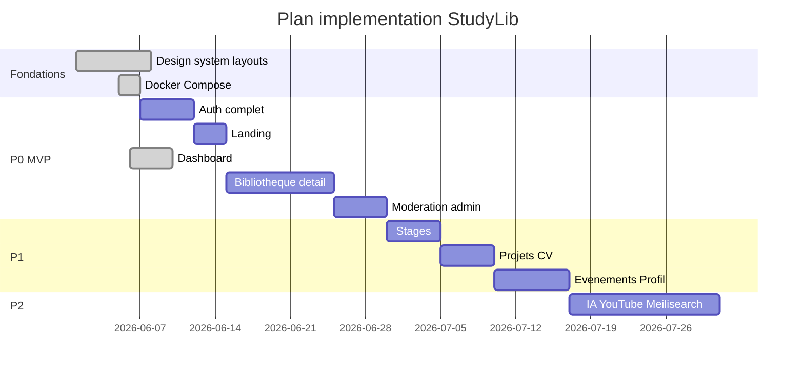

### Dépendances entre modules

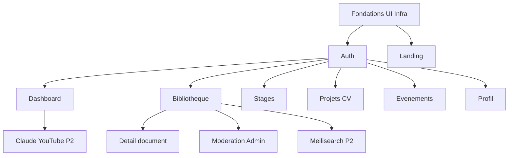

### Ordre d'exécution (1 module à la fois)

1. Fondations (terminées)
2. Auth — register + tests
3. Landing
4. Dashboard (livré — validation visuelle)
5. Bibliothèque (listing + filtres + upload)
6. Détail document (show, download, rating)
7. Admin modération
8. Stages
9. Projets CV
10. Événements
11. Profil
12. Post-MVP (IA, YouTube, notifications, Meilisearch)

---

## 17. Backlog MVP (priorisation)

### P0 — Indispensable

- [x] Fondations UI (design system, layouts, Docker)
- [x] Auth complète (register blade, tests)
- [x] Landing page
- [x] Dashboard étudiant
- [x] Bibliothèque + upload + détail + download
- [x] Modération admin (approve / reject)
- [x] Filières + modules (seeders)

### P1 — MVP enrichi

- [x] Notation documents (UI)
- [x] Avis de stages + entreprises
- [x] Projets CV
- [x] Événements (lecture + admin CRUD UI)
- [x] Profil utilisateur
- [x] Notifications in-app (page + cloche topbar)

### P2 — Post-MVP

- [ ] Suggestions Claude (`ClaudeService`)
- [ ] Recommandations YouTube (`YouTubeService`) — cache partiel en place
- [ ] Recherche Meilisearch
- [ ] Queues Redis production
- [ ] Score de matching stages réel (remplacer « Match 92 % » placeholder)

---

## 18. État d'avancement

| Composant | Statut | Notes |
|---|---|---|
| Migrations PostgreSQL (13 tables métier) | ✅ | UUID, FK, index |
| Services + Repositories | ✅ | 16 services |
| Policies + Form Requests | ✅ | |
| Design system Tailwind + Flaticon | ✅ | `resources/css/app.css`, `config/flaticon.php` |
| Layouts + chrome Livewire | ✅ | sidebar, topbar, bottom nav, cloche notifications |
| Docker Compose | ✅ | postgres, redis, minio, meilisearch |
| Auth (login + register Blade/Livewire) | ✅ | Domaine @hestim.ma |
| Dashboard + KPIs documentés | ✅ | `DashboardService`, section 11 de ce rapport |
| Bibliothèque, détail, upload, notation | ✅ | Tests Feature |
| Modération admin + KPIs | ✅ | `ModerationService::statusCounts()` |
| Stages, Projets CV, Profil | ✅ | Livewire + tests |
| Événements (étudiant + admin CRUD) | ✅ | KPIs admin via `EventService::adminStats()` |
| Notifications in-app | ✅ | Page `/notifications` + JSON API |
| Meilisearch intégration code | ❌ | Infra Docker prête |
| IA Claude / YouTube production | ⏳ | Services présents, clés API à configurer |
| Tests PHPUnit | ✅ | 97 tests passants (dernière exécution complète) |

---

## 19. Annexes — textes réutilisables

### Introduction type mémoire

> Ce projet consiste en la conception et le développement de **StudyLib**, une plateforme web collaborative à destination des étudiants de HESTIM. Face à la dispersion des ressources pédagogiques et à l'absence de mémoire collective sur les stages et projets, StudyLib propose un espace unique, sécurisé et modéré, accessible depuis le domaine institutionnel `@hestim.ma`. L'architecture retenue s'appuie sur Laravel et PostgreSQL, avec une séparation stricte entre présentation, logique métier et accès aux données.

### Méthodologie

> Le projet suit une approche **incrémentale** : fondations transverses (design system, layouts, infrastructure), puis modules métier livrés un par un (auth, dashboard, bibliothèque, etc.). Chaque module est aligné sur une maquette validée (`docs/prototype/`), testé via PHPUnit, et conforme aux principes SOLID et Clean Architecture.

### Choix technologiques (justification)

| Choix | Justification |
|---|---|
| Laravel | Écosystème mature, auth, ORM, queues, communauté |
| PostgreSQL | Intégrité relationnelle, JSON, performances, open source |
| Livewire | Interactivité sans SPA complexe, cohérent avec Blade |
| MinIO | Compatible S3, self-hosted, adapté aux fichiers pédagogiques |
| UUID | Identifiants non séquentiels, fusion / export facilités |

### Limites et perspectives

- Recherche full-text Meilisearch en phase P2 (infra Docker prête, code à intégrer)
- Filtrage collaboratif et matching stages avancé non implémentés (placeholders UI documentés section 12)
- Favoris étudiants non implémentés (prévu navigation)
- Vérification email (`verified`) à harmoniser avec `MustVerifyEmail`
- Déploiement production (CI/CD, HTTPS, backups) hors périmètre actuel
- Dépendance API Claude : coût tokens, disponibilité réseau — atténuée par rate limit (20/h) et fallback local

### Glossaire

| Terme | Définition |
|---|---|
| **Filière** | Parcours académique HESTIM (ex. Génie Informatique) |
| **Module** | Unité d'enseignement rattachée à une filière et un semestre |
| **Document** | Fichier pédagogique (cours, examen, TD, TP) |
| **Modération** | Validation admin avant publication (`approved`) |
| **KPI** | Indicateur affiché dans l'interface pour piloter l'activité — voir [section 11](#11-indicateurs-de-performance-kpi) |
| **Content-based filtering** | Recommandation par similarité de contenu/profil (filière, module) — voir [section 12](#12-systèmes-de-recommandation-et-intelligence-artificielle) |
| **LLM** | Large Language Model — ici Claude (Anthropic) pour génération d'idées projets |
| **BM25** | Algorithme de ranking textuel utilisé par Meilisearch (planifié P2) |
| **MVP** | Produit minimum viable (P0 + P1) |

---

## 20. Index des fichiers sources

| Document | Chemin |
|---|---|
| Contexte technique agent | `docs/AGENT_CONTEXT.md` |
| **Ce rapport** | `docs/RAPPORT.md` |
| ERD interactif (HTML) | `docs/diagramme/schema_bdd.html` |
| Design tokens | `docs/prototype/tokens.css` |
| Design system complet | `docs/design-system/StudyLib Design System.html` |
| KPI dashboard / admin | `app/Services/DashboardService.php`, `ModerationService.php`, `EventService.php` |
| Recommandations & IA | `DashboardService`, `DocumentRepository`, `ProjectIdeaService`, `ClaudeService`, `YouTubeService` — [section 12](#12-systèmes-de-recommandation-et-intelligence-artificielle) |
| Maquettes écrans | `docs/prototype/StudyLib *.html` |
| Règles projet IA | `.cursor/rules/studylib.mdc` |
| Routes | `routes/web.php`, `routes/auth.php` |
| Migrations | `database/migrations/` |
| Styles production | `resources/css/app.css` |
| Navigation | `config/studylib.php` |
| Infrastructure | `docker-compose.yml` |

---

*Document généré pour faciliter la rédaction du rapport. Les diagrammes Mermaid peuvent être exportés en PNG/SVG via [mermaid.live](https://mermaid.live) pour insertion dans Word ou LaTeX.*
