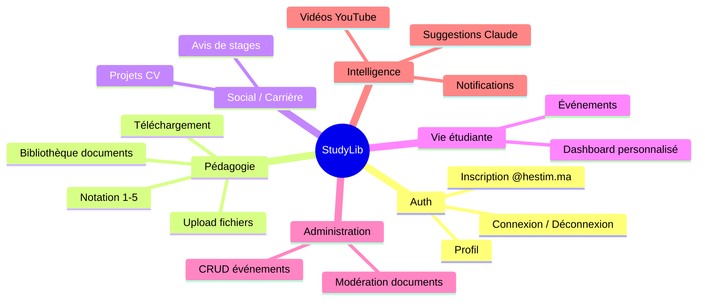
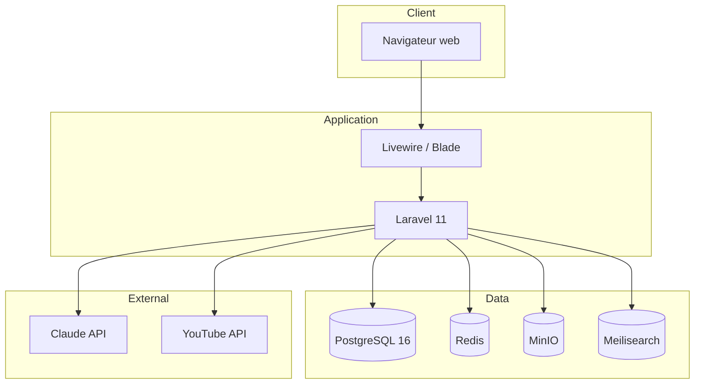
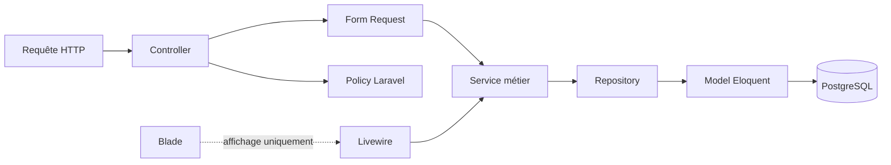
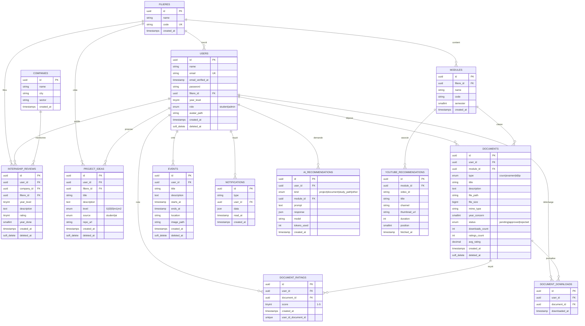
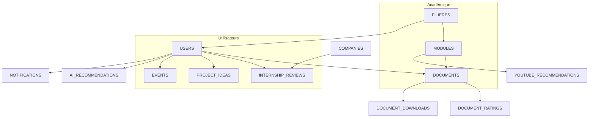
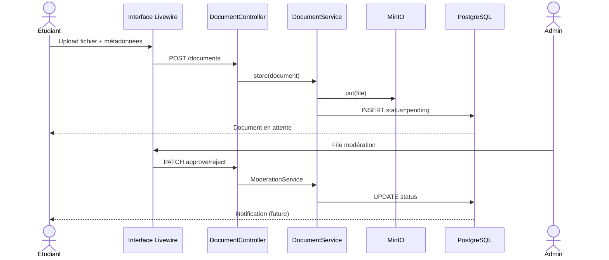
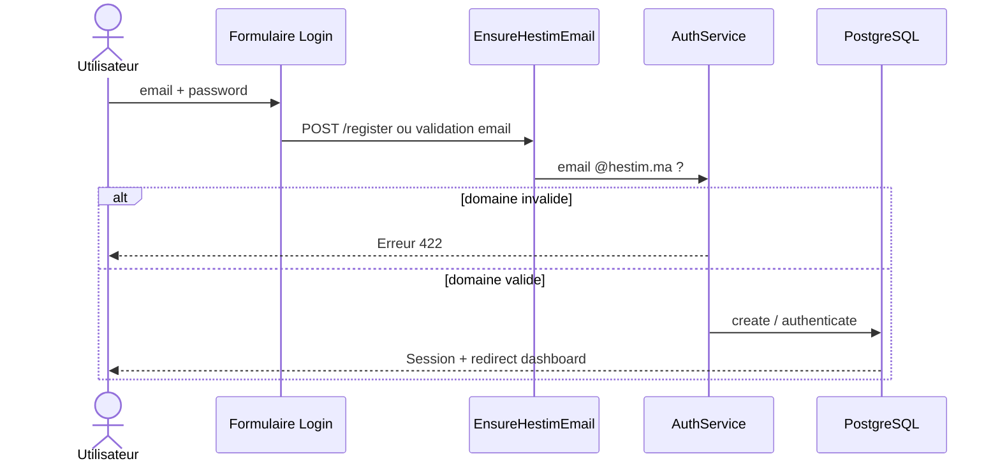
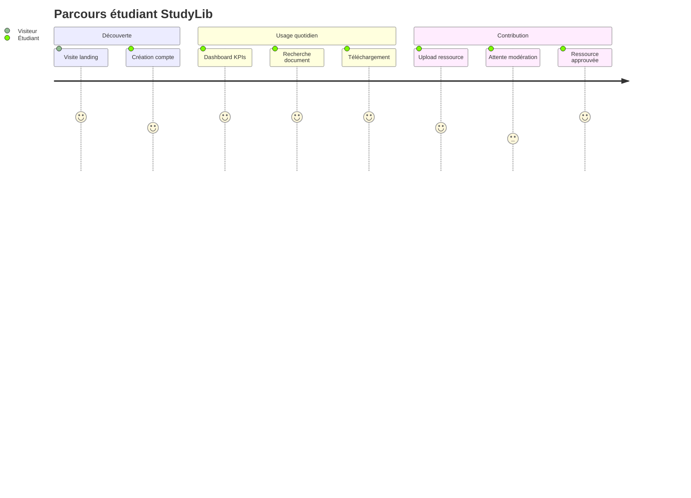
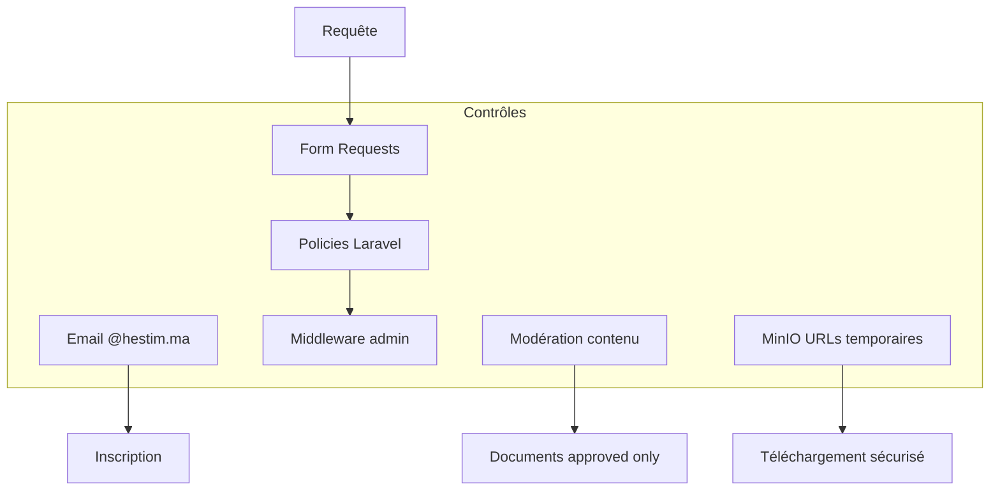
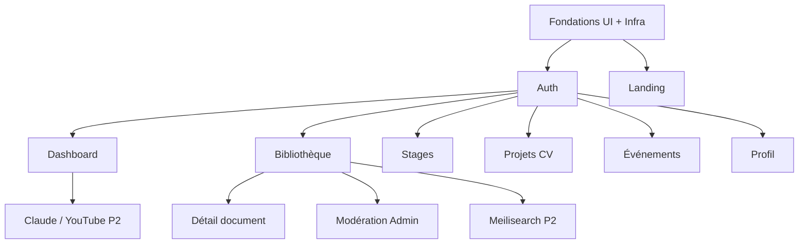

# StudyLib — Document de référence pour le rapport

> **Usage** : ce fichier centralise vision, architecture, schémas, maquettes, backlog et état d'avancement du projet StudyLib. Il sert de base à la rédaction d'un rapport académique ou technique (mémoire, PFE, dossier projet).
>
> **Dernière mise à jour** : 6 juin 2026  
> **Sources** : `docs/AGENT_CONTEXT.md`, `docs/diagramme/`, `docs/prototype/`, `docs/design-system/`, code source Laravel

---

## Table des matières

1. [Résumé exécutif](#1-résumé-exécutif)
2. [Contexte et problématique](#2-contexte-et-problématique)
3. [Objectifs du projet](#3-objectifs-du-projet)
4. [Périmètre fonctionnel](#4-périmètre-fonctionnel)
5. [Stack technique](#5-stack-technique)
6. [Architecture logicielle](#6-architecture-logicielle)
7. [Modèle de données (ERD)](#7-modèle-de-données-erd)
8. [Dictionnaire des entités](#8-dictionnaire-des-entités)
9. [Flux et cas d'utilisation](#9-flux-et-cas-dutilisation)
10. [Parcours utilisateur et maquettes](#10-parcours-utilisateur-et-maquettes)
11. [Design system et interface](#11-design-system-et-interface)
12. [Sécurité et conformité](#12-sécurité-et-conformité)
13. [Infrastructure et déploiement](#13-infrastructure-et-déploiement)
14. [Plan d'implémentation](#14-plan-dimplémentation)
15. [Backlog MVP (priorisation)](#15-backlog-mvp-priorisation)
16. [État d'avancement](#16-état-davancement)
17. [Annexes — textes réutilisables](#17-annexes--textes-réutilisables)
18. [Index des fichiers sources](#18-index-des-fichiers-sources)

---

## 1. Résumé exécutif

**StudyLib** est une plateforme web collaborative destinée aux étudiants de **HESTIM** (Maroc). Elle vise à centraliser les ressources pédagogiques (cours, examens, TD, TP), faciliter le partage d'expériences de stage, proposer des idées de projets CV, recommander du contenu (IA Claude, YouTube) et gérer les événements de l'établissement, avec une modération administrative du contenu déposé.

L'application repose sur **Laravel 11**, **PostgreSQL 16**, une architecture en couches (Clean Architecture), et une interface **Blade / Livewire / Tailwind CSS** conforme à un design system propriétaire.

**Contrainte métier majeure** : seuls les emails `@hestim.ma` peuvent s'inscrire.

---

## 2. Contexte et problématique

### Contexte

Les étudiants d'une école d'ingénieurs et de management disposent de ressources pédagogiques dispersées (groupes WhatsApp, drives personnels, emails). Les retours de stage et les bonnes pratiques ne sont pas structurés. Les événements et ressources officielles manquent de visibilité centralisée.

### Problématique (formulation type rapport)

> Comment concevoir et développer une plateforme web sécurisée permettant aux étudiants HESTIM de centraliser, partager et consulter des ressources pédagogiques, tout en garantissant la qualité du contenu via modération, l'identification institutionnelle des utilisateurs et une expérience mobile-first accessible ?

### Solution proposée

Une application web monolithique Laravel avec :

- Authentification restreinte au domaine `@hestim.ma`
- Bibliothèque documentaire par filière et module
- Workflow de modération (pending → approved / rejected)
- Modules complémentaires : stages, projets CV, événements, profil, administration
- Intégrations futures : stockage objet (MinIO), recherche (Meilisearch), IA (Claude), vidéos (YouTube)

---

## 3. Objectifs du projet

| Type | Objectif |
|---|---|
| **Principal** | Centraliser les ressources pédagogiques par filière et module |
| **Secondaire** | Partager les avis de stages et entreprises |
| **Secondaire** | Proposer des idées de projets CV (étudiants + IA) |
| **Secondaire** | Afficher événements et recommandations (YouTube, IA) |
| **Transverse** | Modération admin, sécurité, accessibilité WCAG AA, mobile-first |
| **Technique** | Architecture maintenable (SOLID, services, repositories) |

---

## 4. Périmètre fonctionnel

### Acteurs

| Acteur | Description |
|---|---|
| **Visiteur** | Consulte la landing page, peut accéder au login |
| **Étudiant** | Utilisateur authentifié `@hestim.ma`, rôle `student` |
| **Administrateur** | Modération documents, gestion événements, rôle `admin` |

### Modules fonctionnels



---

## 5. Stack technique

| Couche | Technologie | Rôle |
|---|---|---|
| Backend | Laravel 11, PHP 8.3 | API web, ORM, auth, queues |
| Frontend | Blade, Livewire 4, Alpine.js | Interface réactive |
| Styles | Tailwind CSS v4 | Design system `sl-*` |
| Base de données | PostgreSQL 16 | Données relationnelles, UUID |
| Cache / sessions | Redis 7 | Performance, sessions |
| Fichiers | MinIO (S3-compatible) | PDF, DOCX, PPTX |
| Recherche | Meilisearch | Full-text (post-MVP) |
| IA | Claude API | Recommandations |
| Vidéo | YouTube Data API v3 | Recommandations par module |
| Conteneurisation | Docker Compose | Dev / déploiement |
| Qualité code | Laravel Pint (PSR-12) | Formatage |
| Tests | PHPUnit | Feature + Unit |

### Schéma d'infrastructure



---

## 6. Architecture logicielle

### Principe : Clean Architecture

La logique métier est **exclusivement** dans `app/Services/`. Les controllers et composants Livewire orchestrent et délèguent. L'accès aux données passe par des **repositories** (interfaces + implémentations Eloquent).



### Couches applicatives

| Couche | Emplacement | Responsabilité |
|---|---|---|
| Présentation | `resources/views/`, `app/Livewire/` | UI, interactions, pas de métier |
| HTTP | `app/Http/Controllers/` | Routing, autorisation, délégation |
| Validation | `app/Http/Requests/` | Règles d'entrée |
| Métier | `app/Services/` | Règles, orchestration, transactions |
| Données | `app/Repositories/` | Requêtes, agrégations |
| Domaine | `app/Models/`, `app/Enums/` | Entités, états |
| Sécurité | `app/Policies/`, `app/Http/Middleware/` | Autorisations |

### Arborescence backend (simplifiée)

```
app/
├── Enums/           DocumentType, DocumentStatus, UserRole, StudyLevel, IdeaSource, AiKind
├── Http/
│   ├── Controllers/ Auth, Document, Event, Profile, Admin, …
│   ├── Middleware/  EnsureHestimEmail, EnsureUserIsAdmin
│   └── Requests/    Validation par module
├── Livewire/        Dashboard, Layout, Auth, Ui
├── Models/          13 modèles (UUID)
├── Policies/        Document, Event, User, …
├── Repositories/    Contracts + Eloquent
└── Services/        16 services métier
```

### Services métier

| Service | Responsabilité |
|---|---|
| `AuthService` | Inscription, validation domaine @hestim.ma |
| `ProfileService` | Profil, avatar |
| `FiliereService` / `ModuleService` | Données académiques |
| `DocumentService` | Upload MinIO, listing, URLs temporaires |
| `RatingService` | Notes 1-5, agrégats |
| `DownloadService` | Journal téléchargements |
| `ModerationService` | Approve / reject |
| `CompanyService` | Entreprises de stage |
| `InternshipReviewService` | Avis stages |
| `ProjectIdeaService` | Projets CV |
| `EventService` | Événements |
| `NotificationService` | Notifications |
| `DashboardService` | KPIs, recommandations dashboard |
| `ClaudeService` | API Claude |
| `YouTubeService` | API YouTube |

### Injection de dépendances

Les interfaces repository sont liées aux implémentations Eloquent dans `app/Providers/RepositoryServiceProvider.php`.

---

## 7. Modèle de données (ERD)

### Diagramme entité-relation complet

> Compatible Mermaid (GitHub, Notion, VS Code, export PDF via [mermaid.live](https://mermaid.live)).



### Diagramme simplifié (vue métier)



### Clés et conventions

- **Clés primaires** : UUID (`HasUuids` Laravel)
- **Soft deletes** : `users`, `documents`, `internship_reviews`, `project_ideas`, `events`
- **Compteurs dénormalisés** sur `documents` : `downloads_count`, `ratings_count`, `avg_rating`
- **Filières seedées** : GI, GC, GIND, MGT

---

## 8. Dictionnaire des entités

| Table | Description métier | Relations principales |
|---|---|---|
| `filieres` | Filières HESTIM | → modules, users |
| `users` | Comptes étudiants et admins | → filiere, documents, avis, … |
| `modules` | Unités d'enseignement (semestre) | → filiere, documents |
| `documents` | Ressources pédagogiques fichiers | → module, auteur, ratings |
| `document_ratings` | Notes utilisateur (1-5) | → user, document |
| `document_downloads` | Traçabilité téléchargements | → user, document |
| `companies` | Entreprises de stage | → internship_reviews |
| `internship_reviews` | Retours d'expérience stage | → user, company, filiere |
| `project_ideas` | Idées projets portfolio | → user, filiere |
| `events` | Événements école | → user (créateur) |
| `notifications` | Alertes in-app (JSON) | → user |
| `youtube_recommendations` | Cache vidéos par module | → module |
| `ai_recommendations` | Historique prompts Claude | → user, module |

### Énumérations métier

| Enum PHP | Valeurs | Usage |
|---|---|---|
| `DocumentType` | cours, examen, td, tp | Classification ressource |
| `DocumentStatus` | pending, approved, rejected | Workflow modération |
| `UserRole` | student, admin | Autorisations |
| `StudyLevel` | l1, l2, l3, m1, m2 | Projets CV |
| `IdeaSource` | student, ai | Origine idée projet |
| `AiKind` | project, document, study_path, other | Type suggestion IA |

---

## 9. Flux et cas d'utilisation

### Diagramme de cas d'utilisation (UML simplifié)


### Flux : dépôt et modération d'un document



### Flux : authentification HESTIM



### Routes API / Web principales

| Méthode | URI | Nom | Accès |
|---|---|---|---|
| GET | `/` | `home` | Public |
| GET | `/login` | `login` | Guest |
| POST | `/login` | `login.store` | Guest |
| POST | `/register` | `register` | Guest |
| POST | `/logout` | `logout` | Auth |
| GET | `/dashboard` | `dashboard` | Auth |
| GET/POST | `/documents` | `documents.*` | Auth |
| GET | `/documents/{id}` | `documents.show` | Auth |
| POST | `/documents/{id}/download` | `documents.download` | Auth |
| POST | `/documents/{id}/ratings` | `documents.ratings.store` | Auth |
| GET/POST | `/internship-reviews` | `internship-reviews.*` | Auth |
| GET/POST | `/project-ideas` | `project-ideas.*` | Auth |
| GET | `/events` | `events.index` | Auth |
| GET/PATCH | `/profile` | `profile.*` | Auth |
| GET | `/admin/moderation/documents` | `admin.moderation.*` | Admin |
| POST/PUT/DELETE | `/admin/events` | `admin.events.*` | Admin |

---

## 10. Parcours utilisateur et maquettes

### Correspondance maquette → écran → route

| # | Maquette (`docs/prototype/`) | Vue Blade cible | Route | Priorité |
|---|---|---|---|---|
| 1 | StudyLib Landing.html | `pages/landing.blade.php` | `home` | P0 |
| 2 | StudyLib Login.html | `pages/auth/login.blade.php` | `login` | P0 |
| 3 | StudyLib Dashboard.html | `pages/dashboard/index.blade.php` | `dashboard` | P0 |
| 4 | StudyLib Bibliothèque.html | `pages/documents/index.blade.php` | `documents.index` | P0 |
| 5 | StudyLib Détail Document.html | `pages/documents/show.blade.php` | `documents.show` | P0 |
| 6 | StudyLib Admin.html | `pages/admin/index.blade.php` | `admin.moderation.index` | P0 |
| 7 | StudyLib Stages.html | `pages/internship-reviews/index.blade.php` | `internship-reviews.index` | P1 |
| 8 | StudyLib Projets CV.html | `pages/project-ideas/index.blade.php` | `project-ideas.index` | P1 |
| 9 | StudyLib Événements.html | `pages/events/index.blade.php` | `events.index` | P1 |
| 10 | StudyLib Profil.html | `pages/profile/show.blade.php` | `profile.show` | P1 |

### Parcours étudiant type



### Navigation application (sidebar / mobile)

Configurée dans `config/studylib.php` :

- **Principal** : Accueil (dashboard), Bibliothèque, Stages, Projets, Événements
- **Personnel** : Mes dépôts, Favoris (futur), Profil
- **Mobile** : Accueil, Biblio, Stages, Projets, Profil + FAB dépôt

---

## 11. Design system et interface

### Sources

| Fichier | Contenu |
|---|---|
| `docs/prototype/tokens.css` | Tokens CSS (couleurs, typo, espacements) |
| `docs/design-system/StudyLib Design System.html` | Catalogue composants |
| `resources/css/app.css` | Implémentation Tailwind + classes `sl-*` |

### Tokens principaux

| Catégorie | Exemples |
|---|---|
| Couleurs primaires | `#1D4ED8` (primary), `#DBEAFE` (primary-soft) |
| Neutres | ink `#0F172A`, muted `#64748B`, surface `#F8FAFC` |
| Sémantiques | success, warning, danger, info |
| Typographie | Inter (sans), JetBrains Mono (mono) |
| Rayons | sm 10px, md 14px, lg 18px |
| Layout | header 64px, sidebar 264px, container 1200px |

### Composants UI implémentés

| Composant | Fichier Blade | Usage |
|---|---|---|
| Bouton | `components/ui/button.blade.php` | Actions primaires/secondaires |
| Badge | `components/ui/badge.blade.php` | Statuts, compteurs |
| Input / Field | `components/ui/input.blade.php` | Formulaires |
| Search | `components/ui/search.blade.php` | Barre recherche |
| Card ressource | `components/ui/card.blade.php` | Bibliothèque |
| Table | `components/ui/table.blade.php` | Admin, listes |
| Uploader | `components/ui/uploader.blade.php` | Dépôt fichiers |
| Pagination | `components/ui/pagination.blade.php` | Listes paginées |
| Toast / Flash | `components/ui/toast.blade.php` | Retours système |
| Modal | `components/ui/modal.blade.php` | Confirmations |
| Empty state | `components/ui/empty-state.blade.php` | Listes vides |
| Star rating | `components/ui/star-rating.blade.php` | Notation documents |

### Layouts

| Layout | Usage |
|---|---|
| `<x-layouts.app>` | Espace authentifié (sidebar, topbar, bottom nav) |
| `<x-layouts.guest>` | Login / register |
| `<x-layouts.admin>` | Administration |
| `<x-layouts.marketing>` | Landing page |

### Principes UX

- Mobile-first, responsive (breakpoints ~860px, ~920px)
- Accessibilité WCAG AA (focus visible, labels, aria)
- Pas d'écrans ou champs inventés hors maquettes
- Pas de tiret cadratin double `——` dans l'UI

---

## 12. Sécurité et conformité



| Mesure | Implémentation |
|---|---|
| Authentification domaine | `HestimEmail`, `EnsureHestimEmail`, `AuthService` |
| Autorisation | Policies sur Document, Event, User, … |
| Validation entrées | Form Requests dédiées |
| Visibilité documents | `approved` OU auteur OU admin |
| Fichiers | Stockage MinIO, pas d'exposition directe des chemins |
| Rôles | `student` / `admin` via `UserRole` |
| CSRF | Tokens Laravel sur formulaires |
| Mots de passe | Hash bcrypt (Laravel default) |

---

## 13. Infrastructure et déploiement

### Docker Compose (`docker-compose.yml`)

| Service | Image | Port par défaut | Rôle |
|---|---|---|---|
| postgres | postgres:16-alpine | 5432 | Base de données |
| redis | redis:7-alpine | 6379 | Cache, sessions, queues |
| minio | minio/minio | 9000 / 8900 | Stockage fichiers |
| meilisearch | getmeili/meilisearch:v1.12 | 7700 | Recherche full-text |

### Variables d'environnement cibles

```env
DB_CONNECTION=pgsql
DB_HOST=postgres
DB_DATABASE=studylib

REDIS_HOST=redis
CACHE_STORE=redis
SESSION_DRIVER=redis
QUEUE_CONNECTION=redis

MINIO_ENDPOINT=http://minio:9000
MINIO_BUCKET=studylib

MEILISEARCH_HOST=http://meilisearch:7700

CLAUDE_API_KEY=
YOUTUBE_API_KEY=
```

### Comptes de test (seed)

| Email | Rôle | Mot de passe |
|---|---|---|
| `admin@hestim.ma` | admin | `password` |
| `etudiant@hestim.ma` | student | `password` |

---

## 14. Plan d'implémentation

### Phases


### Dépendances entre modules



### Ordre d'exécution (1 module à la fois)

1. Fondations (terminées)
2. Auth — register + tests
3. Landing
4. Dashboard (livré — validation visuelle)
5. Bibliothèque (listing + filtres + upload)
6. Détail document (show, download, rating)
7. Admin modération
8. Stages
9. Projets CV
10. Événements
11. Profil
12. Post-MVP (IA, YouTube, notifications, Meilisearch)

---

## 15. Backlog MVP (priorisation)

### P0 — Indispensable

- [x] Fondations UI (design system, layouts, Docker)
- [ ] Auth complète (register blade, tests)
- [ ] Landing page
- [x] Dashboard étudiant
- [ ] Bibliothèque + upload + détail + download
- [ ] Modération admin (approve / reject)
- [x] Filières + modules (seeders)

### P1 — MVP enrichi

- [ ] Notation documents (UI)
- [ ] Avis de stages + entreprises
- [ ] Projets CV
- [ ] Événements (lecture + admin CRUD UI)
- [ ] Profil utilisateur

### P2 — Post-MVP

- [ ] Suggestions Claude (`ClaudeService`)
- [ ] Recommandations YouTube (`YouTubeService`)
- [ ] Notifications in-app
- [ ] Recherche Meilisearch
- [ ] Queues Redis production

---

## 16. État d'avancement

| Composant | Statut | Notes |
|---|---|---|
| Migrations PostgreSQL (13 tables métier) | ✅ | UUID, FK, index |
| Services + Repositories | ✅ | 16 services |
| Policies + Form Requests | ✅ | |
| Design system Tailwind | ✅ | `resources/css/app.css` |
| Layouts + chrome Livewire | ✅ | sidebar, topbar, bottom nav |
| Docker Compose | ✅ | postgres, redis, minio, meilisearch |
| Login (Blade + Livewire) | ✅ | GET `/login` |
| Dashboard (Blade + Livewire) | ✅ | Tests PHPUnit OK |
| Landing, Register, Bibliothèque, … | ⏳ | Controllers encore JSON |
| Meilisearch intégration code | ❌ | Infra Docker prête |
| Tests E2E complets | ⏳ | Dashboard + DS partiels |

---

## 17. Annexes — textes réutilisables

### Introduction type mémoire

> Ce projet consiste en la conception et le développement de **StudyLib**, une plateforme web collaborative à destination des étudiants de HESTIM. Face à la dispersion des ressources pédagogiques et à l'absence de mémoire collective sur les stages et projets, StudyLib propose un espace unique, sécurisé et modéré, accessible depuis le domaine institutionnel `@hestim.ma`. L'architecture retenue s'appuie sur Laravel et PostgreSQL, avec une séparation stricte entre présentation, logique métier et accès aux données.

### Méthodologie

> Le projet suit une approche **incrémentale** : fondations transverses (design system, layouts, infrastructure), puis modules métier livrés un par un (auth, dashboard, bibliothèque, etc.). Chaque module est aligné sur une maquette validée (`docs/prototype/`), testé via PHPUnit, et conforme aux principes SOLID et Clean Architecture.

### Choix technologiques (justification)

| Choix | Justification |
|---|---|
| Laravel | Écosystème mature, auth, ORM, queues, communauté |
| PostgreSQL | Intégrité relationnelle, JSON, performances, open source |
| Livewire | Interactivité sans SPA complexe, cohérent avec Blade |
| MinIO | Compatible S3, self-hosted, adapté aux fichiers pédagogiques |
| UUID | Identifiants non séquentiels, fusion / export facilités |

### Limites et perspectives

- Recherche full-text et IA en phase post-MVP
- Favoris étudiants non implémentés (prévu navigation)
- Vérification email (`verified`) à harmoniser avec `MustVerifyEmail`
- Déploiement production (CI/CD, HTTPS, backups) hors périmètre actuel

### Glossaire

| Terme | Définition |
|---|---|
| **Filière** | Parcours académique HESTIM (ex. Génie Informatique) |
| **Module** | Unité d'enseignement rattachée à une filière et un semestre |
| **Document** | Fichier pédagogique (cours, examen, TD, TP) |
| **Modération** | Validation admin avant publication (`approved`) |
| **MVP** | Produit minimum viable (P0 + P1) |

---

## 18. Index des fichiers sources

| Document | Chemin |
|---|---|
| Contexte technique agent | `docs/AGENT_CONTEXT.md` |
| **Ce rapport** | `docs/RAPPORT.md` |
| ERD interactif (HTML) | `docs/diagramme/schema_bdd.html` |
| Design tokens | `docs/prototype/tokens.css` |
| Design system complet | `docs/design-system/StudyLib Design System.html` |
| Maquettes écrans | `docs/prototype/StudyLib *.html` |
| Règles projet IA | `.cursor/rules/studylib.mdc` |
| Routes | `routes/web.php`, `routes/auth.php` |
| Migrations | `database/migrations/` |
| Styles production | `resources/css/app.css` |
| Navigation | `config/studylib.php` |
| Infrastructure | `docker-compose.yml` |

---

*Document généré pour faciliter la rédaction du rapport. Les diagrammes Mermaid peuvent être exportés en PNG/SVG via [mermaid.live](https://mermaid.live) pour insertion dans Word ou LaTeX.*
